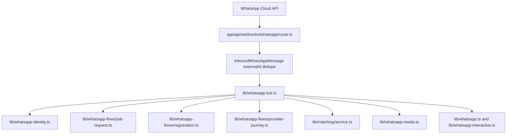
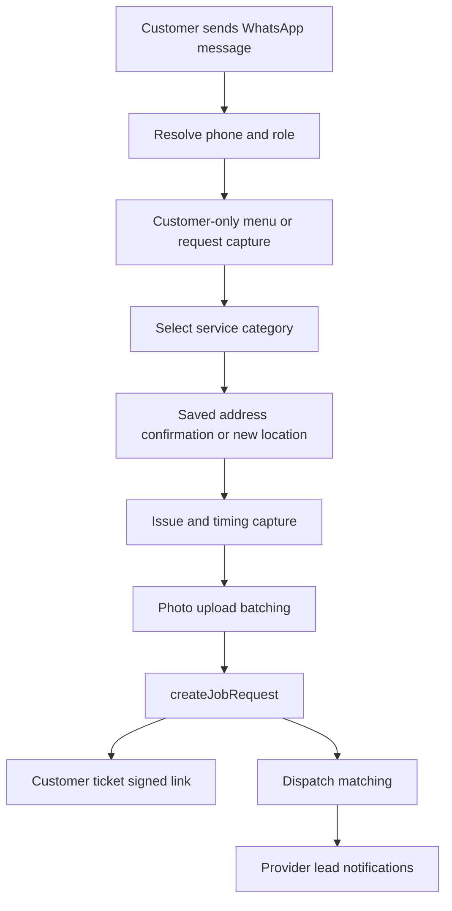
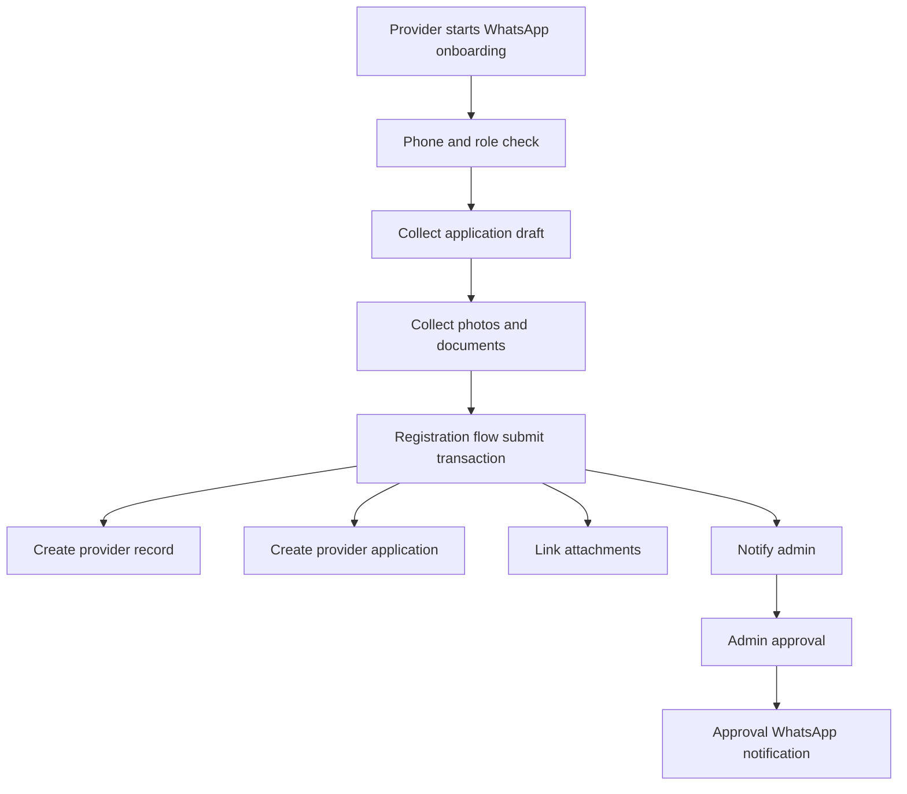
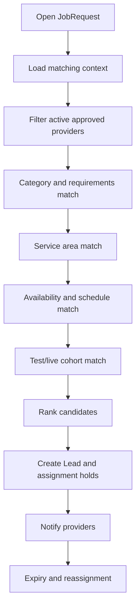
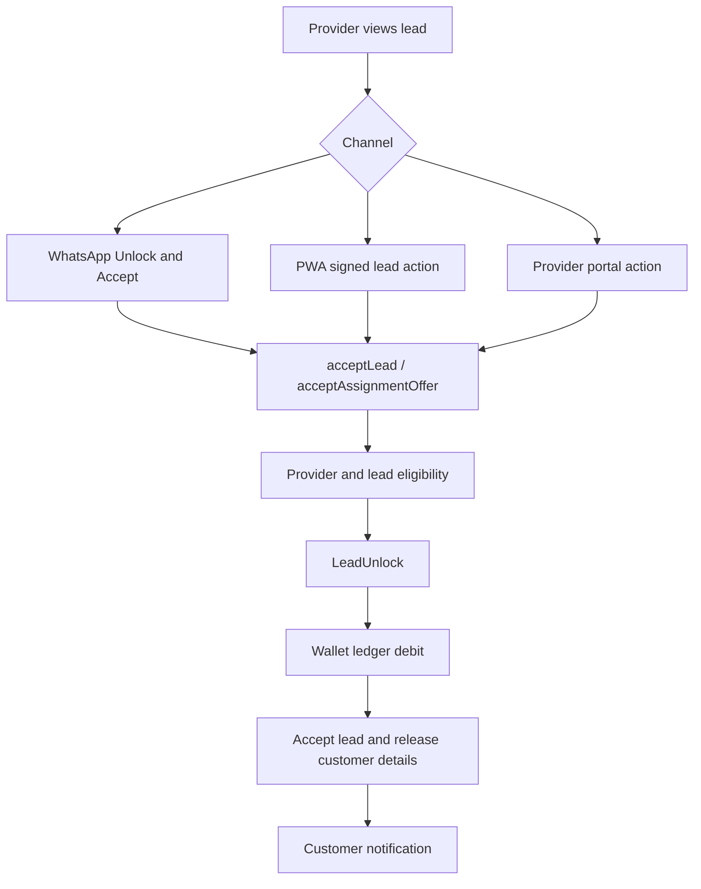
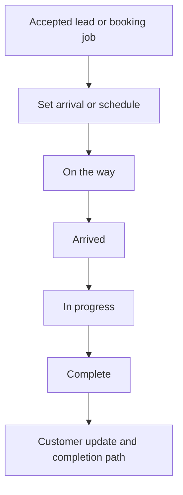
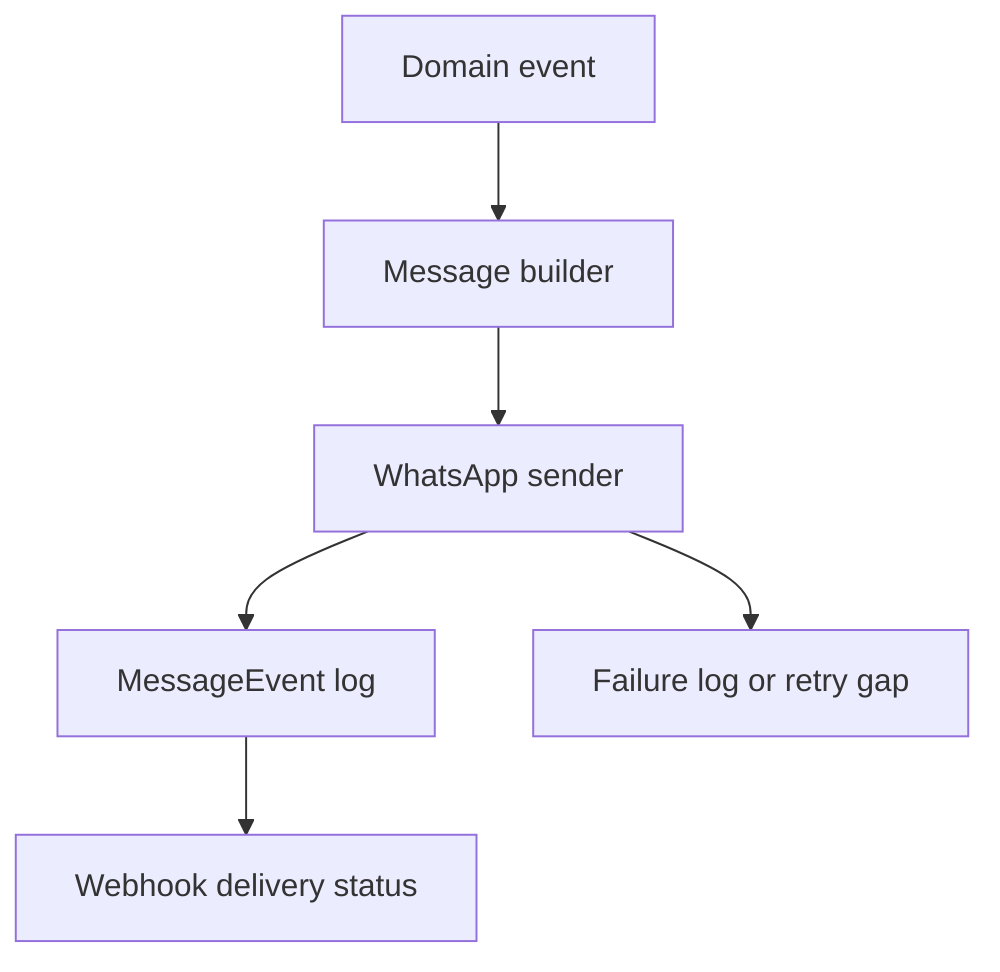
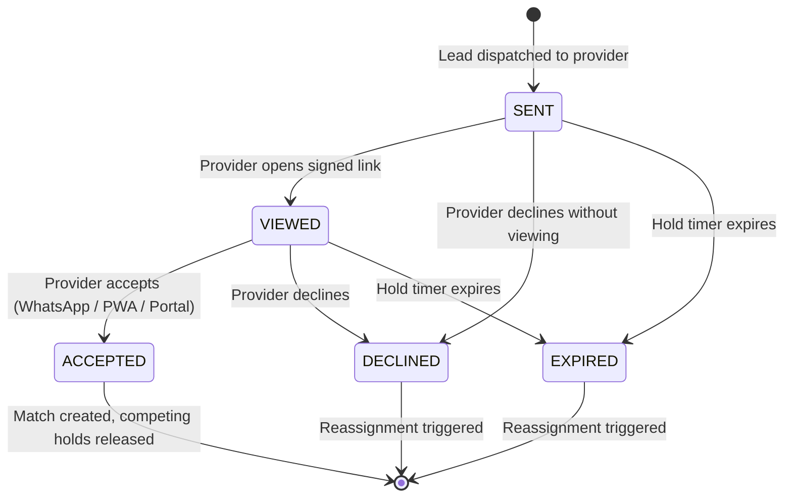

# Plug A Pro Codebase Architecture Review

OpenBrain-compatible implementation note:

- Review date: 2026-05-01
- Scope: architecture review only. No platform refactors were implemented.
- Sources reviewed: repository README files, domain documentation under `docs/`, Prisma schema, Next.js route handlers, WhatsApp flow handlers, provider/customer PWA routes, wallet and matching modules, signed-link modules, media modules, notification modules, and test files.
- Current product priority: provider monetisation through a ledger-first credit wallet system.

## 1. Executive Summary

Plug A Pro has a recognisable architecture: a Next.js field-service application with WhatsApp as the primary communication channel, PWA signed links for structured actions, Prisma as the data layer, Supabase Auth for Worker Portal login, WhatsApp Cloud API for messaging, and Vercel Blob for media storage.

The architecture is holding up best where there are deep Modules with small Interfaces and meaningful Implementation behind them. The strongest examples are:

- `field-service/lib/provider-wallet.ts`, which keeps credit balances ledger-first and separates paid and promo credits.
- `field-service/lib/lead-unlocks.ts`, which centralises most lead unlock charging and provider eligibility checks.
- `field-service/lib/job-requests/create-job-request.ts`, which gives customer request submission a transaction boundary and a focused Interface.
- `field-service/lib/whatsapp-media.ts`, which hides WhatsApp download and Blob upload complexity behind a small media-storage Interface.

The most fragile areas are where the same business concept is coordinated across WhatsApp handlers, PWA routes, signed-link resolvers, Prisma transactions, and notification senders without one owning Module. The largest hotspots are:

- `field-service/lib/whatsapp-bot.ts`
- `field-service/lib/whatsapp-flows/job-request.ts`
- `field-service/lib/whatsapp-flows/registration.ts`
- `field-service/lib/whatsapp-flows/provider-journey.ts`
- `field-service/lib/matching/service.ts`
- `field-service/app/leads/access/[token]/page.tsx`
- `field-service/lib/accepted-job-actions.ts`

The highest-risk findings are:

1. Lead unlock, acceptance, customer-detail release, duplicate acceptance prevention, and notifications are partly centralised but still coordinated by several channel Adapters. This creates drift risk between WhatsApp, signed-link PWA, and provider portal actions.
2. Identity resolution is better than before, but phone normalisation, role resolution, provider/customer conflict handling, OTP login validation, and test cohort detection are spread across multiple Modules.
3. WhatsApp conversation orchestration is overloaded. Session state, stale replies, customer/provider routing, media batching, role-aware menus, and notification-reply handling are concentrated in a large route-like Module.
4. Signed-link access is functional but split across several token systems and route-level authorization checks. This weakens Locality around token scope, expiry, revocation, route protection, and attachment access.
5. Notifications have several local idempotency patterns instead of one Notification Dispatch Module. Duplicate prevention exists in places, but the Interface is inconsistent and logging depends on caller discipline.

This is not a rewrite situation. The next architecture work should deepen a small number of high-Leverage Modules, then move WhatsApp and PWA paths behind those Modules as Adapters.

## 2. Current Architecture Map

### Main app framework

The main application lives in `field-service/` and uses:

- Next.js App Router under `field-service/app/`
- React client/server components for PWA screens
- Prisma models under `field-service/prisma/schema.prisma`
- Supabase Auth for OTP and session handling
- WhatsApp Cloud API utilities under `field-service/lib/whatsapp*.ts`
- Vercel Blob for attachment storage through `field-service/lib/whatsapp-media.ts`
- Vitest tests under `field-service/__tests__/`
- Playwright end-to-end tests under `field-service/e2e/`

### Routing structure

Observed route groups:

- `field-service/app/(customer)/...`: customer booking, requests, provider handover, completion and approval routes.
- `field-service/app/(provider)/...`: provider dashboard, leads, jobs, profile, availability, earnings, credits, and job actions.
- `field-service/app/(technician)/...`: technician-facing route group, currently mirroring and extending provider routes for field execution tasks.
- `field-service/app/(admin)/...`: admin provider applications, provider wallets, lead unlock disputes, dispatch, reports, messages, and operational pages.
- `field-service/app/(auth)/...`: customer, provider, and admin sign-in and verify flows.
- `field-service/app/leads/access/[token]/page.tsx`: signed provider lead PWA action surface.
- `field-service/app/requests/access/[token]/page.tsx`: signed customer ticket surface.
- `field-service/app/requests/handover/[token]/page.tsx`: signed customer provider-handover surface.
- `field-service/app/provider/jobs/[jobId]/handover/page.tsx`: signed provider accepted-job handover entry.
- `field-service/app/api/webhooks/whatsapp/route.ts`: WhatsApp webhook entrypoint.
- `field-service/app/api/attachments/[id]/route.ts`: attachment proxy and authorization route.
- `field-service/proxy.ts`: public, provider, and admin route protection.

### WhatsApp entry points

The WhatsApp inbound path is:

The webhook entrypoint is strong on inbound dedupe through `InboundWhatsAppMessage.externalId`. The fragility starts after dispatch, where `lib/whatsapp-bot.ts` becomes a broad Adapter and partial orchestrator for identity, session state, media batching, role conflicts, menu routing, and stateless notification replies.

### PWA entry points

Important PWA action routes include:

- `field-service/app/leads/access/[token]/page.tsx`
- `field-service/app/(provider)/provider/leads/[leadId]/page.tsx`
- `field-service/app/(provider)/provider/jobs/[jobId]/...`
- `field-service/app/(provider)/provider/availability/page.tsx`
- `field-service/app/(auth)/provider-sign-in/page.tsx`
- `field-service/app/(auth)/provider-verify/page.tsx`
- `field-service/app/requests/access/[token]/page.tsx`
- `field-service/app/requests/handover/[token]/page.tsx`

These routes are mostly channel Adapters, but several still contain business-rule mapping, error-code translation, and state-transition coordination that should live behind deeper domain Interfaces.

### Backend and domain modules

Important domain Modules:

- `field-service/lib/provider-wallet.ts`
- `field-service/lib/lead-unlocks.ts`
- `field-service/lib/job-requests/create-job-request.ts`
- `field-service/lib/matching/service.ts`
- `field-service/lib/provider-lead-access.ts`
- `field-service/lib/job-request-access.ts`
- `field-service/lib/customer-provider-handover-access.ts`
- `field-service/lib/whatsapp-identity.ts`
- `field-service/lib/whatsapp-media.ts`
- `field-service/lib/messaging-templates.ts`
- `field-service/lib/post-match-communications.ts`
- `field-service/lib/provider-application-notifications.ts`
- `field-service/lib/accepted-job-actions.ts`
- `field-service/lib/jobs.ts`
- `field-service/lib/message-events.ts`
- `field-service/lib/internal-test-cohort.ts`

### Data layer

The data model is Prisma-first. The schema includes Customers, Providers, ProviderApplications, JobRequests, Leads, LeadUnlocks, Matches, Bookings, Jobs, Wallets, LedgerEntries, Attachments, Conversations, MessageEvents, InboundWhatsAppMessages, AuditLogs, dispatch records, and support cases.

Useful state and idempotency primitives already exist:

- Unique customer and provider phone records.
- Unique lead per `(jobRequestId, providerId)`.
- Unique `LeadUnlock.leadId`, which prevents double charging the same lead.
- `InboundWhatsAppMessage.externalId` for WhatsApp inbound dedupe.
- Provider application fields for approval notification locks.
- Message event metadata and status fields.
- Wallet ledger entries with status and paid/promo separation.

The data model is broad enough for the product, but several state machines are not centralised in code.

### Integration adapters

Observed external Adapters:

- WhatsApp Cloud API: `field-service/lib/whatsapp.ts`, `field-service/lib/whatsapp-interactive.ts`, `field-service/lib/whatsapp-media.ts`
- Supabase Auth: `field-service/lib/supabase*`, `field-service/app/api/auth/...`
- Vercel Blob: `field-service/lib/whatsapp-media.ts`, `field-service/app/api/attachments/[id]/route.ts`
- PayFast: `field-service/app/api/webhooks/payfast/route.ts`, `field-service/app/api/webhooks/payments/route.ts`, and credit-payment Modules
- OpenBrain-aligned notes and operational logging: docs and trace/audit conventions, but not yet one observable support Module

### Test structure

The test suite is broad and valuable. It includes:

- Unit tests for wallet, lead unlock, matching, identity, signed links, notification helpers, and media behavior.
- API tests for webhooks, auth, attachments, provider credits, signed routes, and admin operations.
- End-to-end tests for key user paths.

The main test weakness is that the Interface under test is sometimes a route handler or page action instead of a domain Module. The interface is the test surface; where a route is the test surface, business-rule drift between WhatsApp and PWA remains harder to detect.

## 3. Domain Flow Map

### Customer request flow

Current strengths:

- Existing customer recognition and saved address reuse are present.
- Customer request creation has a good transaction boundary in `createJobRequest`.
- Attachment linking failures have explicit error handling.

Current fragility:

- WhatsApp capture logic is large and owns too many journey transitions.
- Photo batching is in-memory and not durable across serverless execution.
- Customer role and provider conflict checks exist in several places.

### Provider onboarding flow

Current strengths:

- Application submit has transaction handling, duplicate prevention, and attachment validation.
- Approval notification has a lock to prevent duplicate sends.

Current fragility:

- Final application submission is embedded in `registration.ts`, so the journey Adapter owns business logic that should be a deeper Module.
- Provider status, approval, verified, active, and KYC language do not have one clear owner.

### Lead matching flow

Current strengths:

- `matching/service.ts` contains meaningful domain knowledge.
- Active, verified, status, availability, area, skill, and test cohort checks are enforced in the main matching path.

Current fragility:

- Matching service is deep but too wide. It owns ranking, dispatch, holds, acceptance, expiry, job creation, notification triggers, and some credit behavior.
- `matching-engine.ts`, `matching/filter.ts`, and `matching/candidate-pool.ts` duplicate or preserve older eligibility concepts.

### Credit unlock and acceptance flow

Current strengths:

- The credit debit goes through a ledger-first wallet Module.
- `LeadUnlock.leadId` uniqueness prevents repeated debit for the same lead.
- PWA signed lead actions now return more specific error codes than a generic failure.

Current fragility:

- Error mapping and user-facing behavior are still duplicated across WhatsApp, signed PWA, and provider portal surfaces.
- Unlock, assignment, customer detail release, and notification triggers need one deeper Module-level Interface.

### Job execution flow

Current strengths:

- `field-service/lib/jobs.ts` has a clear Job transition table.
- Accepted lead actions include customer notifications and token-scope checks.

Current fragility:

- There are parallel state models: `Job` transitions in `jobs.ts` and accepted-lead `Match` timestamps in `accepted-job-actions.ts`.
- Customer update triggers are attached to multiple state-change paths.

### Notification flow

Current strengths:

- Message events and outbound logs exist.
- Some notification paths have explicit duplicate prevention.

Current fragility:

- Message building, idempotency keys, delivery logging, retry behavior, and test/live guards are scattered across senders and domain Modules.
- Some WhatsApp send helpers only log when a context is passed.

## 4. Key Modules and Seams

**Depth scale used in this section:**

- **Deep** — the Interface is materially smaller than the Implementation. Business rule changes require editing one Module. Callers get significant Leverage.
- **Medium** — the Interface hides some complexity but the Implementation has more than one responsibility or the seam is not fully drawn.
- **Shallow** — the Interface is nearly as complex as the Implementation. Deleting the Module would mostly scatter boilerplate, not eliminate complexity.
- **Shallow-to-medium** — useful helpers exist but the Module boundary is not complete enough to give callers full Leverage.

### Module: WhatsApp Webhook Adapter

- Files involved: `field-service/app/api/webhooks/whatsapp/route.ts`
- Interface: HTTP `GET` webhook verification and `POST` inbound event handling.
- Implementation summary: verifies Meta signatures, parses message and status payloads, deduplicates inbound messages through `InboundWhatsAppMessage.externalId`, and dispatches to `handleWhatsAppMessage`.
- Callers: WhatsApp Cloud API.
- Depth: Medium. The Interface is small and the Implementation hides webhook verification and dedupe, but most domain behavior is delegated to a broad bot Module.
- Current test coverage: webhook API tests exist under `field-service/__tests__/api/`.
- Observability/logging: trace IDs, inbound message records, and message status updates are present.
- Seam assessment: This is a real Adapter seam. It should stay thin.

### Module: WhatsApp Bot Router and Conversation Orchestration

- Files involved: `field-service/lib/whatsapp-bot.ts`, `field-service/lib/whatsapp-flows/types.ts` (ConversationData schema and session types), `field-service/lib/whatsapp-flows/job-request.ts`, `field-service/lib/whatsapp-flows/registration.ts`, `field-service/lib/whatsapp-flows/provider-journey.ts`
- Interface: `handleWhatsAppMessage` and flow handler entrypoints.
- Implementation summary: resolves identity, routes customer/provider messages, handles role conflicts, session expiry, stale replies, stateless notification replies, customer and provider media batching, role-aware menus, lead actions, job actions, and conversational state transitions.
- Callers: WhatsApp webhook route.
- Depth: Shallow-to-medium. The Interface is small, but the Implementation is too wide and has low Locality. One concept often requires reading the bot router, one or more flow files, notification modules, and domain services.
- Current test coverage: multiple WhatsApp flow and webhook tests exist, but the test surface is often the channel behavior rather than a smaller domain Interface.
- Observability/logging: trace IDs and console logs exist, but state transition logs and diagnostic codes are inconsistent across flows.
- Seam assessment: WhatsApp is a real Adapter. Conversation orchestration is a hypothetical Seam becoming real because multiple journeys now need the same stale reply, payload routing, batching, identity, and state rules.

### Module: Identity Resolution

- Files involved: `field-service/lib/whatsapp-identity.ts`, `field-service/lib/utils.ts`, `field-service/lib/phone-normalization.ts`, `field-service/lib/internal-test-cohort.ts`, `field-service/app/api/auth/provider/send-code/route.ts`, `field-service/lib/whatsapp-flows/registration.ts`, `field-service/lib/whatsapp-flows/provider-journey.ts`
- Interface: WhatsApp identity resolver, OTP phone normalisation helpers, and role/assertion helpers.
- Implementation summary: resolves customer/provider/provider-application records by phone variants, detects provider/customer conflicts, recognises saved addresses and active jobs, and validates OTP phone numbers for South Africa.
- Callers: WhatsApp bot, registration flow, provider journey, provider OTP sign-in, customer request creation, matching and reporting code through test cohort helpers.
- Depth: Medium. `whatsapp-identity.ts` has useful Depth, but the wider identity concept is still scattered.
- Current test coverage: identity-related tests exist.
- Observability/logging: trace IDs exist in the WhatsApp identity path; OTP send-code has strong diagnostic logging.
- Seam assessment: Identity is a real Seam because WhatsApp, PWA, Worker Portal, matching, onboarding, and test cohort logic all need it.

### Module: Customer Request Creation

- Files involved: `field-service/lib/job-requests/create-job-request.ts`, `field-service/lib/whatsapp-flows/job-request.ts`, `field-service/app/(customer)/...`, `field-service/lib/job-request-access.ts`
- Interface: `createJobRequest(params)`.
- Implementation summary: validates role conflicts, resolves category and address data, creates or reuses customer and address records, creates the request, links attachments, opens an operational case, and triggers matching after commit.
- Callers: WhatsApp customer flow and PWA/customer request surfaces.
- Depth: Deep. The Interface is smaller than the Implementation and gives strong Leverage.
- Current test coverage: customer request and signed ticket tests exist.
- Observability/logging: trace IDs, explicit error classes, and post-submit logging exist.
- Seam assessment: This Module earns its place. The deletion test says deleting it would scatter request transaction logic across WhatsApp and PWA handlers.

### Module: Provider Application Flow

- Files involved: `field-service/lib/whatsapp-flows/registration.ts`, `field-service/lib/provider-record.ts`, `field-service/lib/provider-applications.ts`, `field-service/lib/provider-application-notifications.ts`, admin application routes under `field-service/app/(admin)/admin/...`
- Interface: conversational registration handler plus lower-level provider record helpers.
- Implementation summary: collects provider application data, validates required fields, handles media evidence, submits a provider application in a transaction, syncs provider records, links attachments, sends applicant/admin notifications, and supports approval notification.
- Callers: WhatsApp bot and admin approval pages.
- Depth: Shallow at the flow boundary, deep in selected helper functions. Application submission itself is too deeply embedded in the WhatsApp Adapter.
- Current test coverage: provider onboarding and application tests exist, but the submit transaction should be tested through a dedicated domain Interface.
- Observability/logging: trace IDs, audit logs, and submit error codes exist; post-commit sync and notification work is less atomic.
- Seam assessment: A Provider Application Submission Module is now a real Seam because WhatsApp onboarding, admin approval, attachment linking, provider record sync, and provider eligibility all depend on it.

### Module: Matching Service

- Files involved: `field-service/lib/matching/service.ts`, `field-service/lib/matching-engine.ts`, `field-service/lib/matching/filter.ts`, `field-service/lib/matching/candidate-pool.ts`, `field-service/app/api/internal/match/...`
- Interface: dispatch, candidate ranking, assignment acceptance/rejection, expiry and reassignment functions.
- Implementation summary: loads matching context, filters providers, ranks candidates, creates leads and holds, sends provider notifications, handles accept/reject, debits credits through lead unlock, releases other holds, and creates job/booking state.
- Callers: customer request creation, WhatsApp lead actions, PWA lead actions, internal match APIs, cron/expiry paths.
- Depth: Deep but overgrown. It has meaningful Implementation Depth, but too many responsibilities behind one broad Module reduce Locality.
- Current test coverage: matching service, filters, expiry, accept/decline, and cohort tests exist.
- Observability/logging: dispatch decisions, match attempts, trace IDs, audit logs, and notification logs exist in parts.
- Seam assessment: Matching is a real domain Seam. The current issue is not absence of a Module, but insufficient boundaries inside a large Module.

### Module: Lead Unlock and Credit Charging

- Files involved: `field-service/lib/lead-unlocks.ts`, `field-service/lib/provider-wallet.ts`, `field-service/lib/matching/service.ts`, `field-service/app/leads/access/[token]/page.tsx`, `field-service/app/(provider)/provider/leads/[leadId]/page.tsx`, `field-service/lib/whatsapp-bot.ts`
- Interface: `unlockLeadForProvider`, `unlockLeadForProviderInTransaction`, and matching acceptance functions.
- Implementation summary: validates provider and lead eligibility, creates unlock records, debits provider wallet ledger, handles duplicate unlocks, maps unlock errors, and participates in acceptance transactions.
- Callers: matching acceptance, PWA signed lead actions, provider portal actions, WhatsApp lead replies.
- Depth: Deep in wallet and unlock charging, shallow around acceptance orchestration.
- Current test coverage: lead unlock, provider wallet, and credit monetisation tests exist.
- Observability/logging: trace IDs, ledger metadata, and some notification logs exist.
- Seam assessment: Credit ledger is a real deep Module. Lead unlock and acceptance as a combined business operation needs more Depth.

### Module: Provider Wallet and Credit Ledger

- Files involved: `field-service/lib/provider-wallet.ts`, `field-service/lib/provider-wallet-notifications.ts`, provider credit admin and payment routes, PayFast webhook routes, wallet Prisma models.
- Interface: credit, debit, refund, adjustment, balance, suspension, and notification helper functions.
- Implementation summary: keeps wallet balances and immutable ledger entries aligned, separates paid and promo credits, supports admin adjustments and refunds, and records transaction metadata.
- Callers: lead unlock, payment crediting, admin wallet screens, provider credit pages, notification paths.
- Depth: Deep. The Interface is materially smaller than the ledger Implementation.
- Current test coverage: wallet, credit top-up, lead monetisation, payment crediting, promo, refund, and admin tests exist.
- Observability/logging: ledger entries and notification logs are present.
- Seam assessment: This Module earns its place. Deleting it would scatter financial rules across routes.

### Module: Signed Link Access

- Files involved: `field-service/lib/provider-lead-access.ts`, `field-service/lib/job-request-access.ts`, `field-service/lib/customer-provider-handover-access.ts`, `field-service/proxy.ts`, `field-service/app/leads/access/[token]/page.tsx`, `field-service/app/requests/access/[token]/page.tsx`, `field-service/app/requests/handover/[token]/page.tsx`, `field-service/app/provider/jobs/[jobId]/handover/page.tsx`, `field-service/app/api/attachments/[id]/route.ts`
- Interface: token generation, verification, scope checks, and route-level resolution helpers.
- Implementation summary: provider lead links use HMAC scoped tokens, customer request tickets use DB-backed opaque tokens, and customer provider handover links use HMAC tokens. Route handlers perform additional authorization and status checks.
- Callers: WhatsApp notifications, PWA signed pages, attachment proxy, job handover route, customer ticket pages.
- Depth: Medium. Each token helper has useful Depth, but the platform access model is fragmented.
- Current test coverage: signed-link access and attachment authorization tests exist.
- Observability/logging: token hashes and trace IDs are logged in several routes. Revocation and jti-level audit are limited.
- Seam assessment: This is a real Seam. Multiple link types and multiple route Adapters now need consistent token policy.

### Module: Attachment Lifecycle

- Files involved: `field-service/lib/whatsapp-media.ts`, `field-service/app/api/attachments/[id]/route.ts`, `field-service/lib/whatsapp-bot.ts`, `field-service/lib/whatsapp-flows/job-request.ts`, `field-service/lib/whatsapp-flows/registration.ts`, `field-service/lib/job-requests/create-job-request.ts`
- Interface: media download/store helper, attachment proxy route, and flow-level attachment collection.
- Implementation summary: downloads WhatsApp media, validates mime and size, uploads to Blob, creates attachment records, deduplicates by media id, links attachments to requests or applications, and serves attachments through authorization checks.
- Callers: customer photo flow, provider application flow, PWA display routes, attachment API.
- Depth: Medium. Media storage itself is deep, but batching, linking, readiness, and rendering are not one Module.
- Current test coverage: media and attachment authorization tests exist.
- Observability/logging: trace IDs and attachment IDs appear in logs, but batch-level lifecycle visibility is weak.
- Seam assessment: This is becoming a real Seam because both customer requests and provider onboarding depend on similar upload batching and attachment readiness.

### Module: Notification and Message Events

- Files involved: `field-service/lib/whatsapp.ts`, `field-service/lib/whatsapp-interactive.ts`, `field-service/lib/message-events.ts`, `field-service/lib/messaging-templates.ts`, `field-service/lib/post-match-communications.ts`, `field-service/lib/provider-wallet-notifications.ts`, `field-service/lib/provider-application-notifications.ts`
- Interface: WhatsApp send helpers, message-event logging, and local notification functions.
- Implementation summary: sends templates, text, interactive messages, and domain-specific notifications; records outbound MessageEvents in some paths; applies duplicate checks in selected Modules.
- Callers: matching, lead acceptance, wallet, provider application approval, job actions, WhatsApp flows.
- Depth: Shallow-to-medium. There are good helpers, but the Notification Dispatch concept is fragmented.
- Current test coverage: notification and post-match communication tests exist.
- Observability/logging: MessageEvent logs exist, but not all helpers require logging context or idempotency keys.
- Seam assessment: One Adapter does not prove a Seam, but there are now many notification Adapters and message types. Notification dispatch is a real Seam.

### Module: Job and Accepted-Lead State

- Files involved: `field-service/lib/jobs.ts`, `field-service/lib/accepted-job-actions.ts`, `field-service/lib/matching/service.ts`, provider job pages, customer handover routes.
- Interface: `transitionJob`, accepted-lead action functions, signed job action pages.
- Implementation summary: `jobs.ts` has explicit Job status transitions and events; accepted-lead actions update Match timestamps and notify customers; matching acceptance creates job/booking state in selected cases.
- Callers: provider PWA, signed job routes, WhatsApp job actions, matching acceptance.
- Depth: Medium. `jobs.ts` is deep for Job records, but the wider job execution model is split between Job and Match.
- Current test coverage: job transition and accepted-job action tests exist.
- Observability/logging: status events and audit logs exist for Job; accepted-lead actions use trace logs and notifications.
- Seam assessment: Job execution is a real Seam because both WhatsApp and PWA provider actions need the same transition guarantees and customer update triggers.

### Module: Worker Portal OTP Login

- Files involved: `field-service/app/(auth)/provider-sign-in/page.tsx`, `field-service/app/(auth)/provider-verify/page.tsx`, `field-service/app/api/auth/provider/send-code/route.ts`, `field-service/lib/phone-normalization.ts`, `field-service/lib/auth.ts`
- Interface: provider sign-in page, send-code API, provider verify page, session helper.
- Implementation summary: normalises South African mobile numbers, verifies provider account status before sending OTP, calls Supabase OTP provider, maps provider errors, and stores session cookies after verification.
- Callers: provider Worker Portal login.
- Depth: Medium. The send-code route is strong; verify and resend paths are thinner and bypass some server-side diagnostics.
- Current test coverage: auth tests exist.
- Observability/logging: send-code has trace IDs and structured diagnostic codes; verify/resend is weaker because the client calls Supabase directly.
- Seam assessment: OTP provider integration is an Adapter; account-level provider auth is a domain Seam.

## 5. Deepening Opportunities

### 1. Identity Resolution Module

- Candidate name: Identity Resolution Module
- Files/modules involved: `field-service/lib/whatsapp-identity.ts`, `field-service/lib/utils.ts`, `field-service/lib/phone-normalization.ts`, `field-service/lib/internal-test-cohort.ts`, `field-service/app/api/auth/provider/send-code/route.ts`, `field-service/lib/whatsapp-flows/registration.ts`, `field-service/lib/whatsapp-flows/provider-journey.ts`
- Problem: phone normalisation, role resolution, provider/customer conflict handling, provider application lookup, saved customer recognition, account auth checks, and test cohort detection are not owned by one Module.
- Why it is shallow or fragile: `whatsapp-identity.ts` is useful, but the broader Interface is still channel-specific. OTP and provider journey code make their own phone and provider assumptions.
- Deletion test result: deleting `whatsapp-identity.ts` would scatter complexity across callers, so it earns its place. However, deleting the duplicated phone helpers in flows would not remove complexity; it would expose missing Depth in a platform identity Module.
- Suggested solution in plain English: deepen identity into a channel-neutral Module that resolves a South African phone number into customer, provider, provider-application, role, conflict, auth eligibility, and test/live cohort facts.
- Expected leverage: high. WhatsApp, PWA, OTP, onboarding, matching, and support tools all benefit.
- Expected locality improvement: high. Role and phone rules move to one place.
- Testability improvement: high. The interface becomes the test surface for role conflicts, saved-customer recognition, provider status, and cohort isolation.
- Risks: account-auth rules may be mixed with messaging identity if the boundary is not kept clear.
- Priority: P0
- Estimated effort: Medium

Explore this candidate further before implementation.

### 2. WhatsApp Conversation Orchestrator Module

- Candidate name: WhatsApp Conversation Orchestrator Module
- Files/modules involved: `field-service/lib/whatsapp-bot.ts`, `field-service/lib/whatsapp-flows/types.ts` (ConversationData/session state), `field-service/lib/whatsapp-flows/job-request.ts`, `field-service/lib/whatsapp-flows/registration.ts`, `field-service/lib/whatsapp-flows/provider-journey.ts`
- Problem: one bot router owns too much: session state (stored via `db.conversation.upsert` in whatsapp-bot.ts with the schema defined in `whatsapp-flows/types.ts`), stale reply handling, role-aware routing, stateless notification replies, interactive payload routing, media batching, and journey transitions.
- Why it is shallow or fragile: the public Interface is small, but the Implementation has low Locality. Business changes require reading thousands of lines across multiple flow files.
- Deletion test result: deleting `whatsapp-bot.ts` would not remove complexity; it would scatter routing and session rules into every flow. The Module earns its place, but it needs deeper internals and smaller journey boundaries.
- Suggested solution in plain English: keep WhatsApp as an Adapter, but introduce a deeper conversation orchestration layer that owns state transitions, stale reply policy, payload routing, batching hooks, and journey handoff rules.
- Expected leverage: high. Customer and provider journeys share the same conversation mechanics.
- Expected locality improvement: high. Flow files can focus on domain capture instead of orchestration mechanics.
- Testability improvement: high. Stale replies, media batch completion, stateless replies, and role-aware menu routing can be tested without the whole bot.
- Risks: over-abstracting the conversation engine could make simple MVP flows harder to change.
- Priority: P0
- Estimated effort: Large

Explore this candidate further before implementation.

### 3. Lead Unlock and Acceptance Module

- Candidate name: Lead Unlock and Acceptance Module
- Files/modules involved: `field-service/lib/lead-unlocks.ts`, `field-service/lib/matching/service.ts`, `field-service/lib/matching-engine.ts`, `field-service/app/leads/access/[token]/page.tsx`, `field-service/app/(provider)/provider/leads/[leadId]/page.tsx`, `field-service/lib/whatsapp-bot.ts`, `field-service/lib/post-match-communications.ts`
- Problem: credit debit, unlock record creation, assignment acceptance, customer-detail release, duplicate accept prevention, error mapping, and customer notification are spread across domain Modules and channel Adapters.
- Why it is shallow or fragile: wallet and unlock are deep, but acceptance as a business operation is shallow because routes still coordinate too much behavior.
- Deletion test result: deleting `lead-unlocks.ts` would scatter charging rules and is not acceptable. Deleting page-level acceptance mapping would mostly expose duplicated behavior, which means a deeper acceptance Interface is needed.
- Suggested solution in plain English: create one domain operation for provider lead acceptance that wraps eligibility, unlock, ledger debit, accepted assignment state, customer-detail release, idempotency, and notification triggers.
- Expected leverage: very high. WhatsApp, signed PWA, and provider portal actions become thin Adapters.
- Expected locality improvement: very high. The user-visible accept result and error contract can live with the transaction.
- Testability improvement: very high. The interface can be tested for insufficient credits, inactive provider, already accepted, expired lead, duplicate action, and notification idempotency.
- Risks: care is required not to weaken existing ledger-first guarantees.
- Priority: P0
- Estimated effort: Large

Explore this candidate further before implementation.

### 4. Provider Application Submission Module

- Candidate name: Provider Application Submission Module
- Files/modules involved: `field-service/lib/whatsapp-flows/registration.ts`, `field-service/lib/provider-record.ts`, `field-service/lib/provider-applications.ts`, `field-service/lib/provider-application-notifications.ts`, admin provider application routes, attachment Modules
- Problem: final onboarding validation, draft preservation, attachment linking, provider record sync, duplicate prevention, audit logging, and admin/applicant notifications are embedded in the WhatsApp registration flow.
- Why it is shallow or fragile: the flow file is acting as both Adapter and domain transaction boundary.
- Deletion test result: deleting the submit code would scatter application logic across onboarding and admin. It deserves a Module, but not inside a conversational handler.
- Suggested solution in plain English: extract provider application submission into a deeper Module with a small submit Interface and explicit result codes. Keep WhatsApp collection as an Adapter.
- Expected leverage: high. Future PWA onboarding, admin retry, and support repair tools can reuse the same submit operation.
- Expected locality improvement: high. Attachment readiness, duplicate application rules, and provider record status become local.
- Testability improvement: high. Submit failures can be tested without simulating a full WhatsApp conversation.
- Risks: migration must preserve existing duplicate-race and attachment-linking behavior.
- Priority: P0
- Estimated effort: Medium

Explore this candidate further before implementation.

### 5. Attachment Lifecycle Module

- Candidate name: Attachment Lifecycle Module
- Files/modules involved: `field-service/lib/whatsapp-media.ts`, `field-service/app/api/attachments/[id]/route.ts`, `field-service/lib/whatsapp-bot.ts`, `field-service/lib/whatsapp-flows/job-request.ts`, `field-service/lib/whatsapp-flows/registration.ts`, `field-service/lib/job-requests/create-job-request.ts`
- Problem: media receipt, debounce/batching, WhatsApp download, storage upload, attachment records, signed URLs, linking, and display readiness are split across bot, flows, storage helper, request submit, application submit, and attachment proxy.
- Why it is shallow or fragile: media storage is deep, but lifecycle state is shallow. In-memory batching is especially fragile in serverless execution.
- Deletion test result: deleting `whatsapp-media.ts` would scatter download and Blob upload complexity. Deleting the in-memory batch code would not remove the need for a durable batch lifecycle.
- Suggested solution in plain English: deepen attachment lifecycle around durable batches, media item status, linking to a target record, and authorised rendering readiness.
- Expected leverage: high. Customer photos and provider onboarding files use the same lifecycle.
- Expected locality improvement: high. Count mismatches and linking failures become easier to diagnose.
- Testability improvement: high. Batch completion, duplicate media IDs, oversize files, failed downloads, and signed display can be tested through one Interface.
- Risks: schema changes may be needed for durable batch state.
- Priority: P1
- Estimated effort: Large

Explore this candidate further before implementation.

### 6. Notification Dispatch Module

- Candidate name: Notification Dispatch Module
- Files/modules involved: `field-service/lib/whatsapp.ts`, `field-service/lib/whatsapp-interactive.ts`, `field-service/lib/message-events.ts`, `field-service/lib/messaging-templates.ts`, `field-service/lib/post-match-communications.ts`, `field-service/lib/provider-wallet-notifications.ts`, `field-service/lib/provider-application-notifications.ts`
- Problem: outbound WhatsApp templates, interactive messages, duplicate prevention, delivery logs, test/live guards, retries, and failure reporting are handled differently in different Modules.
- Why it is shallow or fragile: the send helpers are useful Adapters, but notification dispatch as a domain operation lacks a single Interface.
- Deletion test result: deleting `message-events.ts` would scatter logging and duplicate checks. Deleting local notification wrappers would expose repeated idempotency and copy rules.
- Suggested solution in plain English: introduce one dispatch Module that accepts a domain notification request, resolves template/copy, applies test/live checks, enforces idempotency, sends via WhatsApp Adapter, logs MessageEvent, and exposes retry/failure status.
- Expected leverage: high. Acceptance, approval, wallet, job status, and customer request notifications all benefit.
- Expected locality improvement: high. Message copy and delivery state stop being hidden in business transactions.
- Testability improvement: high. Duplicate suppression, template selection, failure logging, and cohort blocking become one test surface.
- Risks: must not block core transactions on flaky external messaging.
- Priority: P1
- Estimated effort: Medium

Explore this candidate further before implementation.

### 7. Signed Link Access Module

- Candidate name: Signed Link Access Module
- Files/modules involved: `field-service/lib/provider-lead-access.ts`, `field-service/lib/job-request-access.ts`, `field-service/lib/customer-provider-handover-access.ts`, `field-service/proxy.ts`, signed PWA pages, attachment route
- Problem: token generation, scopes, expiry, revocation, route authorization, and attachment access are split across several token helpers and route handlers.
- Why it is shallow or fragile: each token helper is useful, but the platform access model has weak Locality. Route-level authorization branches are easy to drift.
- Deletion test result: deleting any one helper would scatter token handling for that link type. Deleting repeated route checks would expose the need for one access policy Module.
- Suggested solution in plain English: deepen signed-link access around token families, scopes, expiry, revocation, token hashing for logs, and resource authorization decisions.
- Expected leverage: high. WhatsApp View Lead, View Job, customer View Provider, one-job links, and attachment rendering use the same policy.
- Expected locality improvement: high. Route protection and token policy become reviewable in one place.
- Testability improvement: high. Expired, revoked, wrong-scope, wrong-resource, already-accepted, and attachment access cases can be tested through one Interface.
- Risks: changing token policy can break active links if compatibility is not planned.
- Priority: P1
- Estimated effort: Medium

Explore this candidate further before implementation.

### 8. Job State Machine Module

- Candidate name: Job State Machine Module
- Files/modules involved: `field-service/lib/jobs.ts`, `field-service/lib/accepted-job-actions.ts`, `field-service/lib/matching/service.ts`, provider job pages, WhatsApp job actions, customer handover routes
- Problem: job execution state is split between `Job.status` transitions and accepted-lead `Match` timestamps.
- Why it is shallow or fragile: `jobs.ts` is deep for one record type, but the product concept "provider is executing customer work" spans more records than the Module owns.
- Deletion test result: deleting `jobs.ts` would scatter transition rules for Job records. Deleting accepted-job action helpers would expose a parallel state machine embedded in Match updates.
- Suggested solution in plain English: centralise job execution transitions and customer update triggers, while supporting the current accepted-lead and booking/job record shapes.
- Expected leverage: medium-high. WhatsApp and PWA job actions become consistent.
- Expected locality improvement: high. Scheduling, on-the-way, arrived, in-progress, completed, cancellation, and customer notifications become local.
- Testability improvement: high. Illegal transitions and duplicate status actions can be tested once.
- Risks: there may be legitimate differences between quote/booking jobs and accepted-lead jobs that should not be flattened too aggressively.
- Priority: P1
- Estimated effort: Large

Explore this candidate further before implementation.

### 9. Credit Ledger Module

- Candidate name: Credit Ledger Module
- Files/modules involved: `field-service/lib/provider-wallet.ts`, provider wallet admin pages, PayFast webhook routes, lead unlock Modules, promo award Modules, wallet reports
- Problem: the wallet Module is already deep, but reconciliation, reversals, promo expiry, unique external references, and test/live reporting separation need stronger guarantees.
- Why it is shallow or fragile: core debit/credit behavior is deep. Operational ledger support is thinner.
- Deletion test result: deleting `provider-wallet.ts` would scatter financial logic and should not happen. The current deletion test supports keeping and deepening this Module.
- Suggested solution in plain English: preserve the wallet Interface, then add ledger repair/recompute, unique external reference guarantees, explicit reversal flows, promo expiry policy, and test/live reporting separation.
- Expected leverage: high. Payment support, disputes, refunds, and reporting become safer.
- Expected locality improvement: medium-high. Financial operations stay inside the ledger Module.
- Testability improvement: high. Recompute, duplicate payment, reversal, refund, and test-credit reporting can be tested directly.
- Risks: financial migrations must be conservative and auditable.
- Priority: P1
- Estimated effort: Medium

Explore this candidate further before implementation.

### 10. Test Cohort Isolation Module

- Candidate name: Test Cohort Isolation Module
- Files/modules involved: `field-service/lib/internal-test-cohort.ts`, `field-service/lib/matching/service.ts`, `field-service/lib/message-events.ts`, reports, wallet Modules, provider/customer creation paths
- Problem: test/live separation is enforced through flags and helper calls across matching, notifications, reports, wallets, audit logs, and customer/provider records.
- Why it is shallow or fragile: the concept is important enough to be a platform Seam, but enforcement is spread across many call sites.
- Deletion test result: deleting `internal-test-cohort.ts` would scatter classification logic. However, deleting individual manual checks would reveal inconsistent enforcement.
- Suggested solution in plain English: centralise test/live cohort policy and expose simple decisions for matching, notifications, reporting, wallet balances, and support diagnostics.
- Expected leverage: high. Prevents test provider/customer contamination across monetisation and notifications.
- Expected locality improvement: high. Engineers can verify cohort policy without searching the whole codebase.
- Testability improvement: high. Cross-cohort matching, notification blocking, reporting exclusion, and test credit separation can be tested as policy.
- Risks: existing historical data may have inconsistent flags that need migration or support tooling.
- Priority: P0
- Estimated effort: Medium

Explore this candidate further before implementation.

## 6. Defect-Driven Architecture Diagnosis

### WhatsApp and PWA credit logic inconsistency

- Symptom: WhatsApp Unlock and Accept, signed PWA lead accept, and provider portal accept have similar outcomes but independent user-facing error mapping and control flow.
- Likely root architectural cause: acceptance is not a single deep Module Interface. Credit charging is centralised, but the accept operation crosses matching, lead unlock, wallet, signed link, and notification Modules.
- Affected modules: `field-service/lib/lead-unlocks.ts`, `field-service/lib/matching/service.ts`, `field-service/app/leads/access/[token]/page.tsx`, `field-service/app/(provider)/provider/leads/[leadId]/page.tsx`, `field-service/lib/whatsapp-bot.ts`.
- Recommended deepening opportunity: Lead Unlock and Acceptance Module.

### KYC copy appearing even though KYC is not part of MVP

- Symptom: KYC language appears in admin and wallet areas while MVP eligibility is really provider active/verified/status based.
- Likely root architectural cause: provider approval, KYC status, marketplace status, and lead eligibility do not have one clear product-language owner.
- Affected modules: Prisma `Provider.kycStatus`, provider wallet admin pages, admin provider actions, `field-service/lib/provider-record.ts`, matching eligibility.
- Recommended deepening opportunity: Identity Resolution Module plus Provider Application Submission Module. The product label for eligibility should be centralised before more UI copy is added.

### Provider approval and lead eligibility mismatch

- Symptom: provider approval status, active flag, verified flag, application status, availability, and marketplace status can be interpreted differently by onboarding, Worker Portal login, matching, and lead accept paths.
- Likely root architectural cause: provider account state and lead eligibility are enforced in several Modules instead of one policy surface.
- Affected modules: `field-service/lib/provider-record.ts`, `field-service/lib/matching/service.ts`, `field-service/app/api/auth/provider/send-code/route.ts`, `field-service/lib/lead-unlocks.ts`, `field-service/lib/whatsapp-flows/provider-journey.ts`.
- Recommended deepening opportunity: Identity Resolution Module and Lead Unlock and Acceptance Module.

### Duplicate WhatsApp notifications

- Symptom: duplicate outbound notifications can occur when retries, post-commit actions, or missing MessageEvent context bypass a local dedupe guard.
- Likely root architectural cause: notification idempotency is owned locally by several Modules instead of one Notification Dispatch Interface.
- Affected modules: `field-service/lib/whatsapp.ts`, `field-service/lib/whatsapp-interactive.ts`, `field-service/lib/message-events.ts`, `field-service/lib/post-match-communications.ts`, `field-service/lib/provider-wallet-notifications.ts`, `field-service/lib/provider-application-notifications.ts`.
- Recommended deepening opportunity: Notification Dispatch Module.

### Media upload count mismatch

- Symptom: customer or provider sees a different uploaded count from what is linked to the request/application, especially around batched media.
- Likely root architectural cause: media batching is in-memory while durable attachment records and target linking are handled elsewhere.
- Affected modules: `field-service/lib/whatsapp-bot.ts`, `field-service/lib/whatsapp-flows/job-request.ts`, `field-service/lib/whatsapp-flows/registration.ts`, `field-service/lib/whatsapp-media.ts`, `field-service/lib/job-requests/create-job-request.ts`.
- Recommended deepening opportunity: Attachment Lifecycle Module.

### Application submit failures

- Symptom: provider application submission can fail due to duplicate applications, provider/customer phone conflicts, missing required data, or attachment linking problems.
- Likely root architectural cause: the submit transaction is embedded in a conversational flow, reducing Locality for validation and retry behavior.
- Affected modules: `field-service/lib/whatsapp-flows/registration.ts`, `field-service/lib/provider-record.ts`, `field-service/lib/provider-applications.ts`, attachment Modules.
- Recommended deepening opportunity: Provider Application Submission Module.

### OTP UNKNOWN_AUTH_ERROR

- Symptom: provider OTP errors can still appear generic, especially outside the send-code API path.
- Likely root architectural cause: provider send-code has strong server diagnostics, but provider verify and resend still call Supabase from the client and have weaker traceable server-side error classification.
- Affected modules: `field-service/app/api/auth/provider/send-code/route.ts`, `field-service/app/(auth)/provider-sign-in/page.tsx`, `field-service/app/(auth)/provider-verify/page.tsx`, `field-service/lib/phone-normalization.ts`.
- Recommended deepening opportunity: Identity Resolution Module and a tighter account-auth Adapter.

### PWA unlock/decline generic errors

- Symptom: signed PWA accept/decline actions have improved error codes but still contain page-local mapping and generic fallback behavior.
- Likely root architectural cause: there is no single result contract for lead accept/decline across channels.
- Affected modules: `field-service/app/leads/access/[token]/page.tsx`, `field-service/app/(provider)/provider/leads/[leadId]/page.tsx`, `field-service/lib/matching/service.ts`, `field-service/lib/lead-unlocks.ts`.
- Recommended deepening opportunity: Lead Unlock and Acceptance Module.

### Role-aware menu routing problems

- Symptom: customers, providers, pending providers, inactive providers, and unknown phones can be sent to the wrong menu or blocked inconsistently.
- Likely root architectural cause: role resolution and menu routing are split between identity helpers, bot router, registration flow, customer flow, and provider journey flow.
- Affected modules: `field-service/lib/whatsapp-identity.ts`, `field-service/lib/whatsapp-bot.ts`, `field-service/lib/whatsapp-flows/job-request.ts`, `field-service/lib/whatsapp-flows/registration.ts`, `field-service/lib/whatsapp-flows/provider-journey.ts`.
- Recommended deepening opportunity: Identity Resolution Module and WhatsApp Conversation Orchestrator Module.

### Test cohort contamination risk

- Symptom: test providers, customers, credits, notifications, matching, and reports rely on many individual flags and filters.
- Likely root architectural cause: cohort isolation is a cross-cutting policy with no single enforcement Module.
- Affected modules: `field-service/lib/internal-test-cohort.ts`, `field-service/lib/matching/service.ts`, notification Modules, wallet reports, provider/customer creation paths.
- Recommended deepening opportunity: Test Cohort Isolation Module.

## 7. State Machine Review

### Provider application states

Enum: `ApplicationStatus { PENDING | APPROVED | REJECTED }` (Prisma `prisma/schema.prisma`)

Submission creates `PENDING` applications, admin approval sets `APPROVED` or `REJECTED`, and approval notification locks prevent duplicate WhatsApp sends.

Assessment: partially centralised. Submission is embedded in `registration.ts`, while approval logic is in admin pages/actions. A state machine is present in data, but not fully centralised in code.

Weakness: final validation, submit transition, approval transition, notification side effects, and provider record sync do not all pass through one application-state Module.

### Provider account states

Enum: `ProviderStatus { APPLICATION_PENDING | UNDER_REVIEW | ACTIVE | SUSPENDED | ARCHIVED | BANNED }` plus boolean fields `active`, `verified`, and `KycStatus { NOT_STARTED | SUBMITTED | VERIFIED | REJECTED | MANUAL_REVIEW }`.

Matching and lead unlock require `active = true`, `verified = true`, and `status = ACTIVE`. OTP login checks `status`. Provider journey screens interpret active/inactive/pending states.

Assessment: scattered. Provider account state needs a clearer ownership boundary.

Weakness: product language around "approved", "verified", "active", and "KYC" can drift because the eligibility predicate is not one function with a canonical name.

### Lead states

Enum: `LeadStatus { SENT | VIEWED | ACCEPTED | DECLINED | EXPIRED }`

Matching service owns most of this. Signed PWA routes add route-level pre-checks before calling the domain operation.

Assessment: partially centralised in matching, with route-level duplication.

Weakness: accept and decline result contracts are not one Interface across WhatsApp and PWA.

### Job states

Enum: `JobStatus { SCHEDULED | EN_ROUTE | ARRIVED | STARTED | PAUSED | AWAITING_APPROVAL | PENDING_COMPLETION_CONFIRMATION | COMPLETED | CANCELLED | FAILED | CALLBACK_REQUIRED }`

`field-service/lib/jobs.ts` has a clear Job transition map. Accepted-lead work uses `Match` timestamps and separate accepted-job actions.

Assessment: centralised for Job records, scattered for the product-level job execution flow.

Weakness: there are two state models for work execution — `Job.status` and `Match` timestamps (`providerOnTheWayAt`, `providerArrivedAt`, `providerStartedAt`, `providerCompletedAt`).

### Unlock states

Enum: `LeadUnlockStatus { UNLOCKED | REFUNDED | DISPUTED | REVERSED }` plus `LeadUnlockDisputeStatus { OPEN | APPROVED | REJECTED }`.

Unlock creation and wallet debit are centralised in `lead-unlocks.ts` and `provider-wallet.ts`.

Assessment: mostly centralised.

Weakness: reversal/dispute lifecycle and external idempotency could be more explicit. `REVERSED` and `REFUNDED` paths do not have one auditable owner.

### Attachment states

No Prisma enum exists for attachment lifecycle. Attachment records carry `mimeType`, `blobKey`, `url`, and linkage fields, but receipt, batch completion, download status, storage upload, target linking, and display readiness are not one explicit state machine.

Assessment: weak.

Weakness: in-memory batching and post-fact linking make count mismatch and partial failure harder to reason about.

### Notification states

Enum: `MessageStatus { QUEUED | SENT | DELIVERED | READ | FAILED }` on `MessageEvent`.

Delivery receipts are handled by the WhatsApp webhook and update `MessageEvent.status`. Some Modules use sent-started/sent-at locks.

Assessment: partially centralised.

Weakness: `MessageStatus` tracking is not consistently required by all outbound send paths. The `logOutboundMessage` call is optional in `sendText` (only runs when a context is passed).

### Customer request states

Enum: `JobRequestStatus { PENDING_VALIDATION | OPEN | MATCHING | MATCHED | EXPIRED | CANCELLED }`

Request creation is well centralised in `createJobRequest`. Matching moves requests through `OPEN → MATCHING → MATCHED` or `EXPIRED`.

Assessment: good data model, moderate code centralisation.

Weakness: state changes and side effects around dispatch, rematch, expiry, and customer signed ticket updates are spread across matching and route Modules.

## 8. Transaction and Idempotency Review

### Provider application submit

- Current implementation: transactional submit inside `registration.ts`, with duplicate application checks, provider record sync, attachment linking, audit log creation, and post-commit notifications.
- Risk: business operation is hidden inside WhatsApp flow; retries and support repair require reading conversational code.
- Required guarantee: one successful application per active provider phone/application attempt, durable attachment linking, no customer/provider phone conflict, no duplicate admin/applicant notifications.
- Recommended remediation: Provider Application Submission Module with explicit idempotency and result codes.

### Media batch upload

- Current implementation: in-memory batching in WhatsApp bot, immediate media download/store, attachment IDs tracked in conversation data, later linked during submit.
- Risk: serverless cold starts, parallel messages, delayed downloads, or failed storage can produce count mismatches.
- Required guarantee: every received media item has a durable status and target link outcome.
- Recommended remediation: Attachment Lifecycle Module with durable batch records and per-item state.

### Credit unlock

- Current implementation: `lead-unlocks.ts` creates a unique unlock per lead and debits through the wallet ledger in a transaction.
- Risk: external idempotency keys are not the primary contract; acceptance orchestration still spans Modules.
- Required guarantee: exactly one debit per lead/provider unlock, paid/promo separation, no debit on invalid provider or invalid lead.
- Recommended remediation: keep wallet logic, wrap unlock and accept in one acceptance operation.

### Lead acceptance

- Current implementation: matching service validates hold/lead/provider state, calls unlock-in-transaction, updates accepted state, releases competing holds, and triggers communications.
- Risk: channel routes duplicate error mapping and may drift on "already accepted", "expired", "insufficient credits", and "provider inactive".
- Required guarantee: one accepted provider, one customer-detail release, no duplicate customer notification, duplicate accepts return a stable idempotent result.
- Recommended remediation: Lead Unlock and Acceptance Module.

### Lead decline

- Current implementation: provider-specific decline/reject flows update the provider's lead or assignment hold without globally cancelling the request, and no credit is charged.
- Risk: WhatsApp and PWA decline paths still have their own Adapter-level result handling.
- Required guarantee: decline is provider-specific, does not debit credits, does not cancel the customer request globally, and can trigger reassignment/expiry safely.
- Recommended remediation: include decline result contract in the lead action Module.

### Notification sending

- Current implementation: MessageEvent logs plus local duplicate checks in selected Modules.
- Risk: missing context or partial failure can bypass logging/idempotency.
- Required guarantee: notification idempotency by domain event, safe failure logging, retry visibility, test/live guard.
- Recommended remediation: Notification Dispatch Module.

### Signed-link action handling

- Current implementation: HMAC and DB-backed token helpers verify scope/expiry/resource state; route handlers perform additional checks.
- Risk: token revocation and route-level policy drift.
- Required guarantee: wrong scope, wrong resource, expired token, revoked token, accepted/declined/expired lead, and attachment access all resolve consistently.
- Recommended remediation: Signed Link Access Module.

## 9. Security and Access Review

### Signed one-job links

Provider job handover and signed lead links support scoped access and expiry. Logging token hashes instead of raw tokens is a good practice. The weak point is that several token families use different storage and revocation models.

Recommendation: centralise signed-link policy and make revocation capability explicit per token family.

### Worker Portal OTP boundaries

Provider send-code validates South African phone numbers and provider account status before calling Supabase. This is strong. Provider verify and resend paths are weaker because they call Supabase directly from the client and do not have the same server diagnostic boundary.

Recommendation: move verify and resend behind server routes with the same trace and diagnostic contract.

### Customer detail release rules

Customer details are hidden before accepted/unlocked lead access and released after acceptance. This is good. The rule is enforced through provider lead access and matching state, but it should be part of the lead acceptance Module's postcondition.

Recommendation: treat customer-detail release as a domain result of acceptance, not a page rendering concern.

### Provider detail release rules

Customer provider handover links expose provider details after accepted match state. The rule exists, but token policy and handover rendering are separated.

Recommendation: keep provider detail release behind signed-link access policy and accepted match state.

### Role conflicts

Customer/provider phone conflicts are checked in WhatsApp identity and customer/provider creation paths. The rule is important enough to move into a channel-neutral Identity Resolution Module.

Recommendation: one role-conflict policy Interface for WhatsApp, PWA, OTP, and admin support.

### Test cohort isolation

Matching uses test/live filters, notification logging includes cohort concepts, and reports apply filters. Wallet test credit separation is still an operational risk because the balance buckets can be shared by provider.

Recommendation: centralise cohort policy and make reports, matching, notifications, and wallet reporting call it.

### Token logging risks

Some routes log token hashes, which is correct. The risk is future route code logging raw token query params or embedding them in generic errors.

Recommendation: expose a shared token log sanitizer through Signed Link Access.

### Phone normalization risks

South African phone handling exists in multiple helpers. Differences between generic WhatsApp normalization and OTP normalization can create account lookup issues.

Recommendation: one identity phone normalisation policy with explicit channel input adapters.

## 10. Observability and Supportability Review

### Trace IDs

Trace IDs are present in webhook handling, OTP send-code, signed PWA actions, matching, media, and several domain logs. The inconsistency is field naming and coverage.

Recommendation: standardise trace field names and pass trace IDs through domain Interfaces, not only route handlers.

### Error codes

Provider OTP send-code has good structured diagnostic codes. Lead unlock and signed PWA routes also have useful result codes. WhatsApp flows still use more generic user messages in several paths.

Recommendation: domain Modules should return stable error codes that all channel Adapters translate into appropriate copy.

### Audit logs

Audit logs exist for provider applications, job transitions, matching, and admin operations. The issue is not absence, but inconsistent correlation across one user journey.

Recommendation: add journey-level correlation IDs for onboarding submit, lead accept, and media batch lifecycle.

### Notification logs

MessageEvent is the right primitive, but outbound send helpers do not uniformly require idempotency and logging context.

Recommendation: Notification Dispatch should make MessageEvent creation non-optional for product notifications.

### Credit ledger logs

The ledger is strong. Paid and promo credits are separated and wallet operations use immutable ledger entries. Operational support should still get recompute/repair tooling and external reference uniqueness checks.

Recommendation: deepen credit ledger operational tooling without moving ledger logic into routes.

### Media upload logs

Media download/store logs exist, but batch-level observability is weak.

Recommendation: add durable batch ID, item status, target record, and final linked count.

### OpenBrain logging alignment

The codebase has trace IDs and `AuditLog`/`AdminAuditEvent` records, but OpenBrain alignment is mostly a documentation and convention layer. High-risk domain operations do not uniformly emit structured operation notes, making cross-session debugging require manual log correlation.

The five highest-risk domain operations that should emit an OpenBrain-compatible structured log entry after each call are:

1. **Provider application submit** — fields: `operation=provider_application_submit`, `actorPhone`, `providerId`, `applicationId`, `attachmentCount`, `traceId`, `result` (`submitted | duplicate | invalid | error`)
2. **Lead accept** — fields: `operation=lead_accept`, `leadId`, `providerId`, `jobRequestId`, `creditsDebited`, `traceId`, `result` (`accepted | insufficient_credits | expired | taken | inactive_provider | error`)
3. **Credit debit (wallet)** — fields: `operation=wallet_debit`, `providerId`, `amount`, `paidCredits`, `promoCredits`, `ledgerEntryId`, `traceId`, `result` (`debited | insufficient | suspended | error`)
4. **Attachment batch linked** — fields: `operation=attachment_batch_linked`, `targetType` (`job_request | provider_application`), `targetId`, `mediaCount`, `linkedCount`, `failedCount`, `traceId`
5. **Notification dispatched** — fields: `operation=notification_dispatched`, `recipient`, `templateName`, `idempotencyKey`, `messageEventId`, `traceId`, `result` (`sent | duplicate_skipped | test_cohort_blocked | failed`)

These are distinct from `AuditLog` entries, which record admin-initiated mutations. Operation notes record domain system events that are not necessarily triggered by an admin actor but must be traceable for support.

Recommendation: each of the five operations above should write a structured log entry (or extend the existing `AuditLog` with a `system` actor type) so that a support engineer can reconstruct a provider or customer journey without reading raw webhook logs.

### Where screenshots are still insufficient

Screenshots will not be enough for:

- A provider seeing a generic OTP failure without server-side verify diagnostics.
- A provider seeing insufficient credits when the real cause is provider inactive, expired lead, or taken lead.
- A customer/provider seeing missing images when attachment records exist but link status failed.
- A duplicate WhatsApp notification where the second send bypassed MessageEvent context.
- Test/live contamination where the visible UI looks normal but matching or reporting included the wrong cohort.

## 11. Test Architecture Review

### Unit tests

Current strength: wallet, lead unlock, matching helper, identity, signed-link, notification, and utility tests exist.

Gaps:

- Identity result matrix across customer, provider, pending provider, inactive provider, conflict, and test cohort.
- Lead accept result matrix independent of WhatsApp and PWA routes.
- Provider application submit transaction independent of WhatsApp conversation.
- Attachment batch state machine tests once durable batching exists.

### Integration tests

Current strength: several API and route integration tests exist.

Gaps:

- Signed lead accept should assert unlock, ledger entry, accepted state, customer-detail release, and notification idempotency together.
- Provider application submit should assert provider record, application, attachments, audit log, and duplicate retry behavior.
- Customer request submit should assert attachments, ticket, matching dispatch, and support case creation.

### End-to-end tests

Current strength: end-to-end coverage exists under `field-service/e2e/`.

Gaps:

- Mobile-first WhatsApp-to-PWA handoff scenarios.
- Provider signed link expired/fresh-link recovery.
- Worker Portal OTP unhappy paths with diagnostic references.

### WhatsApp webhook tests

Current strength: inbound webhook and message handling tests exist.

Gaps:

- Stale interactive replies.
- Role conflict menu routing.
- Stateless accept/decline replies during expired sessions.
- Media batch debounce across multiple images.

### PWA signed-link tests

Current strength: signed token and attachment authorization tests exist.

Gaps:

- Scope mismatch across view, accept, decline, job action, and contact-customer scopes.
- Expired and revoked token behavior.
- Attachment access before and after acceptance.

### Database transaction tests

Current strength: wallet and matching tests cover important transactional behavior.

Gaps:

- Provider application duplicate race.
- Lead accept concurrent calls from WhatsApp and PWA.
- Decline concurrent with accept.
- Media attachment linking failure rollback or repair behavior.

### Idempotency tests

Current strength: inbound WhatsApp dedupe and lead unlock uniqueness have coverage.

Gaps:

- Notification idempotency by domain event.
- Accepted-lead customer notification duplicate prevention.
- Signed-link repeated action result stability.
- Payment webhook duplicate external reference enforcement — both `app/api/webhooks/payfast/route.ts` and `app/api/webhooks/payments/route.ts` need external reference uniqueness coverage to prevent double-crediting a wallet on retry.

## 12. Recommended Refactor Roadmap

### Phase 1: Stabilize business-rule seams

- Objective: make the most defect-prone business operations channel-neutral.
- Suggested tasks:
  - Deepen Lead Unlock and Acceptance.
  - Deepen Identity Resolution.
  - Extract Provider Application Submission from WhatsApp registration.
  - Define stable domain result codes for accept, decline, submit, and identity conflicts.
- Risk reduced: credit drift, role routing bugs, provider eligibility mismatch, generic PWA errors.
- Expected outcome: WhatsApp and PWA become thinner Adapters over shared business operations.

### Phase 2: Consolidate state machines and idempotency

- Objective: centralise transitions and repeated-action guarantees.
- Suggested tasks:
  - Create a Job State Machine for accepted-lead and Job record actions.
  - Strengthen lead accept/decline idempotency contracts.
  - Add durable media batch state.
  - Add notification idempotency keys by domain event.
- Risk reduced: duplicate accept, duplicate notification, media count mismatch, inconsistent job updates.
- Expected outcome: repeat actions produce predictable results and state transitions become auditable.

### Phase 3: Improve PWA/WhatsApp channel adapters

- Objective: keep WhatsApp as the communication surface and PWA as the structured action surface without duplicating business rules.
- Suggested tasks:
  - Thin `whatsapp-bot.ts` into a routing Adapter over conversation orchestration and domain Modules.
  - Move PWA page actions to shared domain operations.
  - Consolidate signed-link access policy.
  - Move provider verify/resend OTP behind server routes.
- Risk reduced: channel drift, signed-link authorization drift, OTP diagnostic gaps.
- Expected outcome: channel handlers mostly translate input/output and no longer own core rules.

### Phase 4: Improve observability and test coverage

- Objective: make support diagnosis possible without reading screenshots and guessing.
- Suggested tasks:
  - Standardise trace IDs and result codes.
  - Require MessageEvent logging for product notifications.
  - Add media batch diagnostics.
  - Add integration tests around lead accept, provider submit, media batch, and signed-link authorization.
  - Add OpenBrain-aligned operation notes for high-risk domain operations.
- Risk reduced: hard-to-debug production failures and support escalation loops.
- Expected outcome: engineers can trace a customer/provider journey from inbound message through state change and notification.

### Phase 5: Clean up shallow modules

- Objective: remove or absorb wrappers that do not provide enough Depth.
- Suggested tasks:
  - Absorb `matching-engine.ts` into `matching/service.ts`. The deletion test applied in Section 4 shows that `matching-engine.ts` and `matching/filter.ts` are preserving older eligibility concepts that were superseded by `matching/service.ts`. They are candidates for consolidation, not preservation. Confirm no external caller outside the matching module depends on them before merging. `matching/candidate-pool.ts` should be evaluated separately — if it provides a meaningful caching or pool-management abstraction that hides real complexity, it earns its place; if it is a thin wrapper, absorb it.
  - Fold shallow phone/application lookup helpers that are duplicated in `whatsapp-flows/registration.ts` and `whatsapp-flows/provider-journey.ts` into the Identity Resolution Module once Phase 1 is complete.
  - Retire KYC eligibility copy from admin UI once the product terminology decision (Open Question 1/2) is made. This is a copy change, not a schema change.
  - Keep only Adapters that hide real external complexity (WhatsApp Cloud API, Supabase Auth, Vercel Blob, PayFast).
- Risk reduced: duplicated business rules and false seams that cause matching or eligibility regressions.
- Expected outcome: fewer files to read for one concept and clearer ownership boundaries. The matching module in particular should be reviewable without jumping between three files for eligibility logic.

## 13. Open Questions

1. What is the official MVP provider eligibility language: approved, verified, active, KYC-approved, or another term?
2. Should KYC fields remain dormant in the data model while all UI copy avoids KYC, or should the product keep KYC as an internal admin concept?
3. Should a provider be allowed to unlock a lead without accepting it, or is "Unlock and Accept" the only MVP action?
4. What is the expected expiry duration for provider lead links, accepted job links, and customer handover links?
5. Should signed HMAC links have server-side revocation by `jti`, or is status-based invalidation enough for MVP?
6. What is the required retry policy for WhatsApp notifications after domain transactions commit?
7. Should test credits be physically separated from live balances, or is report-level/test flag separation acceptable for now?
8. What is the source of truth for job execution state: `Job`, `Match`, or a planned consolidated operation model?
9. Should Worker Portal provider verify/resend always go through server APIs for traceability?
10. Which provider onboarding failures should be user-recoverable versus admin/support-repairable?
11. Should WhatsApp and PWA lead accept/decline produce identical user-facing error copy, or is it acceptable to have channel-specific phrasing above a shared domain result code? The answer determines whether the Lead Unlock and Acceptance Module must own copy or only result codes.

## 14. Final Candidate List

1. Identity Resolution Module - phone normalisation, role resolution, conflicts, provider account facts, and test cohort facts.
2. WhatsApp Conversation Orchestrator Module - session state, stale replies, interactive routing, batching hooks, and journey transitions.
3. Lead Unlock and Acceptance Module - eligibility, wallet ledger debit, unlock, assignment, idempotency, customer-detail release, and notification trigger.
4. Provider Application Submission Module - final onboarding validation, attachment linking, provider record sync, duplicate prevention, and audit.
5. Attachment Lifecycle Module - media receipt, durable batching, download, storage, attachment records, signed display, and target linking.
6. Notification Dispatch Module - templates, outbound WhatsApp sending, idempotency, delivery logs, failures, retries, and test/live guards.
7. Signed Link Access Module - token families, scopes, expiry, revocation, route authorization, token logging, and attachment access.
8. Job State Machine Module - scheduling, on-the-way, arrived, in-progress, completed, cancellation, and customer update triggers.
9. Credit Ledger Module - reconciliation, reversals, promo expiry, external references, test credit reporting, and support repair.
10. Test Cohort Isolation Module - test/live separation across matching, notifications, reports, credits, and support diagnostics.

Which of these would you like to explore first?
