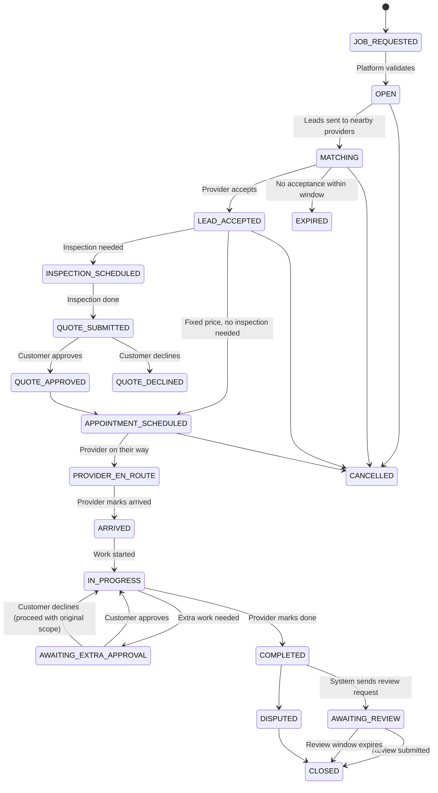
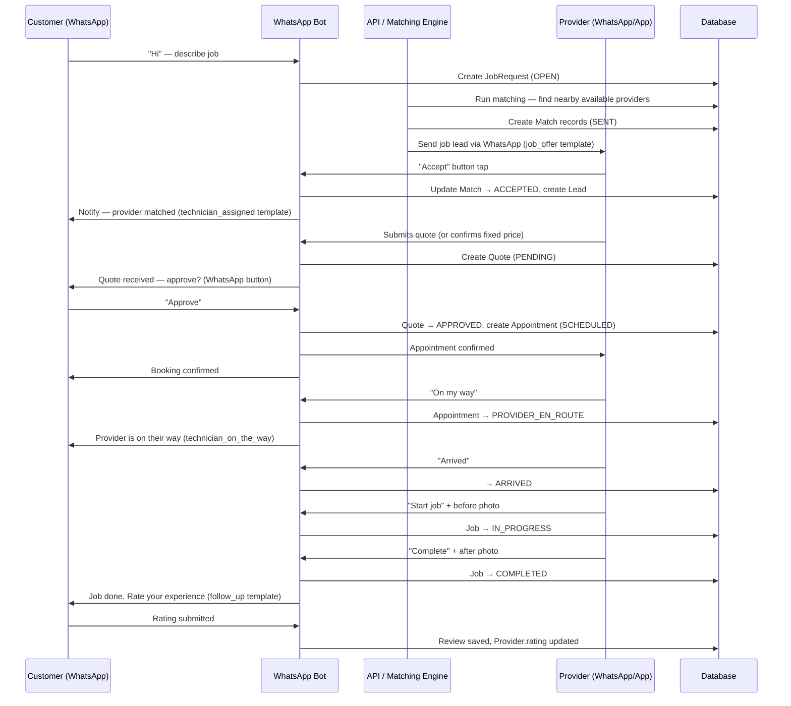

# Plug A Pro — Corrected Marketplace Architecture
**Date:** 2026-03-27
**Status:** Authoritative baseline — supersedes all prior B2B SaaS framing

---

## TASK 1 — INTERPRETATION DRIFT REPORT

### What the platform IS

A peer-to-peer marketplace that connects everyday South African homeowners and renters to nearby independent handymen and home-job workers for small jobs, repairs, inspections, and DIY assistance. The platform acts as the trusted intermediary for discovery, matching, lead routing, mediated communication, quote flow, booking coordination, and trust.

### What it is NOT

It is NOT a field service management SaaS sold to plumbing or electrical companies to manage their employed staff. Every surface of the original codebase reflected the wrong model.

---

### File-by-file drift record

| File | Severity | Incorrect assumption | Correct marketplace behaviour |
|------|----------|---------------------|-------------------------------|
| `Hero.tsx` (old) | High | "Field service, simplified" / "Book a technician" | Dual CTA: "Request help" + "I want work" |
| `ProblemStatement.tsx` (old) | Critical | Pain points: dispatch, staffing, invoicing for a service company | Pain points: customer can't find trusted help; worker has skills but no demand |
| `WhoItsFor.tsx` (old) | Critical | "Built for any business that dispatches technicians" | Job categories customers request; worker types who join |
| `HowItWorksSteps.tsx` (old) | Critical | Step 2: "You dispatch the right technician" | Step 2: Platform matches job to nearby available workers |
| `OperatingModel.tsx` (old) | High | "Your operations team", "Admin console: dispatch" | Platform connects customers and workers; admin = moderation, not staffing |
| `Features.tsx` (old) | High | "Smart Dispatch — assign the right technician in one tap" | Local matching, mediated communication, quote flow, trust layer |
| `PricingCards.tsx` (old) | Critical | B2B SaaS: "Up to 3 technicians / Unlimited technicians" per tier | Marketplace: free for customers; small commission per job for workers |
| `CTAStrip.tsx` (old) | High | "Modernise your field service business" | Dual: "Request help" and "I want work" |
| `SocialProof.tsx` (old) | High | Testimonials from "Operations Manager, Plumbing Business" | Testimonials from homeowners and independent workers |
| `how-it-works/page.tsx` (old) | Critical | `DISPATCH_STEPS`: "Assign the right technician" | Provider-side: register, receive leads, accept, quote, execute |
| `schema.prisma` | Critical | `businessId` FK on Technician, Customer, Booking — multi-tenant SaaS | No tenant isolation; all entities belong to the platform |
| `admin/dispatch/page.tsx` | Critical | Manual admin assignment of platform-owned technicians | Should not exist; providers self-select leads |
| `Job.status` starts at `ASSIGNED` | High | Job is pre-assigned by admin before provider accepts | Job starts at `PENDING_MATCH` or `LEAD_SENT` |
| `Slot` model | Medium | Pre-created business-controlled slots | Provider manages own availability; slots generated on demand |
| `Conversation` unique on `[phone, businessId]` | Medium | Conversation scoped to tenant | Scoped to platform: `[phone]` only |
| `TechnicianApplication.businessId` | High | Apply to work for a specific business | Apply to join the platform |
| `technician_assigned` template language | Medium | "assigned to your booking" implies platform assignment | Should say "a worker has accepted your job lead" |

---

## TASK 2 — CORRECTED MARKETING POSITIONING

### Core positioning

> "Plug A Pro connects everyday people to nearby independent handymen and home-job workers for small jobs, inspections, repairs, and DIY help. Get matched on WhatsApp. Pay a fair price. Trust who shows up."

### What changed in marketing (all components rewritten)

**ProblemStatement:** Now correctly frames the two-sided problem:
- Customer: can't find trusted local help, no way to verify workers, no structured quote
- Worker: skilled but invisible, word-of-mouth is unreliable, no structured way to get demand

**WhoItsFor:** Now shows job categories customers request (plumbing, painting, electrical, gardening, handyman, appliances, installations, DIY help) — not industries that businesses operate in

**HowItWorksSteps:** Now shows the marketplace flow: describe job → get matched → approve and book

**OperatingModel:** Now shows value for both sides: customer (find help, stay private) and worker (receive leads, build reputation)

**Features:** Now shows marketplace trust features: local matching, mediated communication, quote flow, photo evidence, verified reviews

**SocialProof:** Now uses authentic marketplace testimonials — one homeowner, one independent worker, one homeowner with weekend emergency

**CTAStrip + Hero:** Dual CTAs — "Request help" and "I want work"

**PricingCards:** Now dual-sided value proposition: free for customers, commission-per-job for workers

---

## TASK 3 — UPDATED INFORMATION ARCHITECTURE

### Recommended navigation

```
Home
├── How It Works         ← dual flow: customer + worker
├── For Customers        ← job request, matching, privacy, pricing
├── For Workers          ← registration, lead flow, reviews, commission
├── Trust & Safety       ← verification, mediated comms, dispute process
├── FAQ
└── [WhatsApp CTA]       ← sticky or prominent — this is the primary channel

Footer:
├── Contact
├── About
├── Privacy Policy
├── Terms of Use
```

### Pages to create or restructure

| Page | Status | Action |
|------|--------|--------|
| `/` | Exists | Components rewritten ✓ |
| `/how-it-works` | Exists | Page rewritten ✓ |
| `/for-customers` | Missing | Create — detail customer flow, matching, privacy |
| `/for-workers` | Hero has link | Create — registration, lead flow, earnings, reviews |
| `/trust` | Missing | Create — verification, mediation, dispute flow |
| `/faq` | Exists | Review for B2B language |
| `/waitlist` | Exists | Review — should capture both customer and worker intent |
| `/pricing` | Remove or redirect | B2B SaaS pricing no longer applies |
| `/solutions` | Remove or redirect | B2B solutions page no longer relevant |

---

## TASK 4 — ARCHITECTURE GAP ANALYSIS

### Gap table: current → corrected

| Area | Current assumption | Why it is wrong | Corrected marketplace design |
|------|--------------------|-----------------|------------------------------|
| **Core model** | Multi-tenant B2B SaaS (`Business` as tenant) | The platform IS the business; no business tenants | Single-tenant platform; all entities belong to Plug A Pro |
| **Provider identity** | `Technician` scoped to `Business` via FK | Independent workers are not employees of a business | `Provider` entity at platform level; no businessId |
| **Customer identity** | `Customer` scoped to `Business` via FK | Platform customers are not owned by any tenant | `Customer` entity at platform level |
| **Job assignment** | Admin manually assigns technician from their pool | Platform does not own workers; workers self-select | Platform broadcasts lead to matched providers; first acceptance wins |
| **Job initial state** | `ASSIGNED` — someone was assigned before acceptance | Assignment implies ownership | `PENDING_MATCH` → `LEAD_SENT` → `LEAD_ACCEPTED` |
| **Admin dispatch console** | `/admin/dispatch` page for manual assignment | No dispatch in a marketplace | Replace with moderation console: review matches, intervene on disputes |
| **Slot model** | Pre-created capacity windows owned by business | Provider manages own schedule | `ProviderAvailability` owned by provider; booking requests sent to available slots |
| **Conversation scoping** | `[phone, businessId]` unique constraint | Conversations belong to platform, not tenant | `[phone]` only |
| **Application model** | `TechnicianApplication.businessId` | Applying to join the platform, not a company | Remove businessId; applications are platform-level |
| **Payment model** | Platform-managed payments (Peach) | MVP should allow direct payment; escrow is phase 2 | `payment_method: 'platform' | 'direct'` at booking level |
| **Pricing model** | B2B subscription tiers by technician count | Marketplace doesn't charge per technician | Commission per completed job for providers; free for customers |
| **Notification language** | "assigned to your booking", "job assignments" | Assignment implies employment | "lead matched", "worker accepted your job", "quote received" |

### What to REMOVE from MVP

- `/admin/dispatch` page — manual assignment makes no sense
- `Slot` model as currently designed — replace with `ProviderAvailability`
- `Business` as a multi-tenant entity — collapse to platform-level config
- `businessId` FK from `Customer`, `Technician`, `Booking`, `Conversation`, `TechnicianApplication`
- B2B pricing tiers — replace with marketplace value proposition
- Technician PWA job card language ("ASSIGNED", "dispatch") — rename to provider-facing lead management

### What to KEEP

- WhatsApp bot infrastructure (already correct channel)
- Job status state machine (structure is right; statuses need renaming)
- Peach Payments integration (still needed; platform-assisted payment as one option)
- Photo upload (before/after evidence is marketplace-relevant)
- Application review workflow (admin approves providers — just remove businessId)
- Notification templates (update language, not structure)
- Auth / OTP login flow

---

## TASK 5 — CORRECTED MVP DOMAIN MODEL

### Core entities

```
Platform (singleton — replaces Business)
  id, name, whatsappNumber, email, currency, timezone, settings

Customer
  id, userId (nullable), phone, name, email (opt), createdAt, verified

Provider (replaces Technician)
  id, userId (nullable), phone, name, email (opt)
  skills: string[]           — ["Plumbing", "Electrical", ...]
  serviceAreas: string[]     — suburbs/cities they cover
  coverageRadius: int        — km radius from base
  active, verified, onboardedAt
  trustScore: float          — computed from reviews, defaults to null until 3+ reviews

ProviderProfile
  providerId (1:1)
  bio, profilePhotoUrl
  yearsExperience, idVerified, certifications: string[]
  rating: float              — average of confirmed reviews
  reviewCount: int
  completedJobs: int

ServiceCategory
  id, name, slug, description, iconName
  — platform-managed list; providers tag themselves to categories

ProviderAvailability
  providerId, dayOfWeek (0–6), startTime, endTime
  — defines recurring availability; used for lead matching

JobRequest
  id, customerId
  categoryId (FK ServiceCategory)
  description: text          — what needs doing
  urgency: 'urgent' | 'flexible' | 'scheduled'
  preferredDate: date?
  preferredWindow: string?   — "morning" | "afternoon" | "any"
  status: JobRequestStatus
  createdAt

JobRequestStatus:
  DRAFT → OPEN → MATCHING → MATCHED → CANCELLED | EXPIRED

JobPhoto (attached to JobRequest or Job)
  id, jobRequestId or jobId, url, uploadedBy, caption, takenAt

Address
  id, customerId
  suburb, city, province, postalCode
  lat, lng (optional — for proximity matching)

Match (lead candidate)
  id, jobRequestId, providerId
  status: MatchStatus
  sentAt, viewedAt, respondedAt, expiresAt

MatchStatus:
  SENT → VIEWED → ACCEPTED | DECLINED | EXPIRED

Lead (created when Match is ACCEPTED)
  id, jobRequestId, providerId, customerId
  status: LeadStatus
  acceptedAt

LeadStatus:
  ACTIVE → INSPECTION_REQUESTED → QUOTE_SUBMITTED → QUOTE_APPROVED |
  QUOTE_DECLINED → APPOINTMENT_SCHEDULED | CANCELLED

InspectionSlot
  leadId, proposedDate, proposedWindow
  status: 'proposed' | 'confirmed' | 'declined' | 'completed'

Quote
  leadId, providerId
  amount: decimal
  description: text
  validUntil: date
  status: QuoteStatus
  submittedAt, respondedAt

QuoteStatus:
  PENDING → APPROVED | DECLINED | EXPIRED

Appointment (created when quote approved or for fixed-price jobs)
  leadId, scheduledDate, scheduledWindow
  status: AppointmentStatus

AppointmentStatus:
  SCHEDULED → CONFIRMED → PROVIDER_EN_ROUTE → ARRIVED → IN_PROGRESS → COMPLETED | CANCELLED

Job (operational record)
  appointmentId
  providerId, customerId
  status: JobStatus
  startedAt, completedAt
  beforePhotoUrl, afterPhotoUrl
  notes: text

JobStatus:
  IN_PROGRESS → AWAITING_EXTRA_APPROVAL | COMPLETED | ISSUE_RAISED

ExtraWorkRequest
  jobId, description, amount
  status: 'pending' | 'approved' | 'declined'

Review
  jobId, customerId, providerId
  rating: int (1–5)
  comment: text
  createdAt
  — only created after job is COMPLETED

PaymentRecord
  jobId
  amount: decimal
  method: 'platform_assisted' | 'direct_cash' | 'direct_eft'
  status: 'pending' | 'confirmed'
  — MVP: platform records what was agreed; actual payment may be direct

Conversation (platform-mediated messaging)
  leadId or jobId
  channel: 'whatsapp' | 'in_app'
  — messages flow through platform; neither party sees the other's raw number

Message
  conversationId, senderType: 'customer' | 'provider' | 'platform'
  content, sentAt

Dispute
  jobId, raisedBy: 'customer' | 'provider'
  description, status: 'open' | 'investigating' | 'resolved' | 'closed'
  createdAt, resolvedAt

ProviderApplication
  id, phone, name, skills: string[], serviceAreas: string[]
  experience: string, availability: string[]
  status: 'pending' | 'approved' | 'rejected'
  — no businessId; applications are platform-level

Notification (audit log of all sends)
  recipientId, recipientType, channel, templateName
  payload: json, sentAt, deliveredAt, status

AuditLog
  entityType, entityId, action, actorId, actorType, delta: json, createdAt
```

### Key relationships

```
Customer → [JobRequest] → [Match] → Lead → Quote → Appointment → Job → Review
                                          ↓
                                     [InspectionSlot]
                  ↓
Provider → [Match] (receive leads) → Lead → Quote → Appointment → Job → Review
```

### What is deferred (not in MVP)

- Verified identity documents (ID scan, face match)
- Platform-held escrow payments
- Automated dispute resolution
- Subscription/reputation tier for providers
- Multilingual support
- Location GPS tracking on-site

---

## TASK 6 — MARKETPLACE JOB LIFECYCLE

### Single unified lifecycle

```
JOB_REQUESTED
  ↓ (platform validates and opens for matching)
OPEN
  ↓ (matching engine runs — sends leads to qualified nearby providers)
MATCHING
  ↓ (at least one match accepted)
LEAD_ACCEPTED
  ├→ [inspection needed?]
  │     ↓ yes
  │   INSPECTION_SCHEDULED
  │     ↓ (inspection done)
  │   INSPECTION_COMPLETE
  │     ↓
  │   QUOTE_SUBMITTED
  │     ↓ (customer approves)
  │   QUOTE_APPROVED
  │     ↓
  └→ APPOINTMENT_SCHEDULED  ← (also direct path for fixed-price jobs)
       ↓
     PROVIDER_EN_ROUTE
       ↓
     ARRIVED
       ↓
     IN_PROGRESS
       ├→ [extra work needed?]
       │     ↓
       │   AWAITING_EXTRA_APPROVAL
       │     ↓ (approved)
       │   IN_PROGRESS (resume)
       ↓
     COMPLETED
       ↓
     AWAITING_REVIEW
       ↓
     CLOSED

Side exits at any point:
  → CANCELLED (by customer or provider, with reason)
  → EXPIRED (no provider accepted within window)
  → DISPUTED (raised after completion)
```

### Mermaid diagram



### Ownership of each transition

| Transition | Triggered by |
|------------|-------------|
| OPEN → MATCHING | Platform (automatic, cron or on-request) |
| MATCHING → LEAD_ACCEPTED | Provider (accepts lead in WhatsApp or app) |
| MATCHING → EXPIRED | Platform (automatic, configurable window e.g. 2h) |
| LEAD_ACCEPTED → INSPECTION_SCHEDULED | Provider proposes; customer confirms |
| INSPECTION_SCHEDULED → QUOTE_SUBMITTED | Provider (after inspection) |
| QUOTE_SUBMITTED → QUOTE_APPROVED/DECLINED | Customer (via WhatsApp or app) |
| QUOTE_APPROVED → APPOINTMENT_SCHEDULED | Platform (creates appointment) |
| * → PROVIDER_EN_ROUTE | Provider (updates in app or WhatsApp) |
| * → ARRIVED | Provider |
| * → IN_PROGRESS | Provider |
| IN_PROGRESS → AWAITING_EXTRA_APPROVAL | Provider (raises extra work request) |
| * → COMPLETED | Provider |
| COMPLETED → AWAITING_REVIEW | Platform (automatic 24h after completion) |
| * → CANCELLED | Customer or provider (with reason) |
| COMPLETED → DISPUTED | Customer (up to 48h after completion) |

---

## TASK 7 — ANONYMOUS COMMUNICATION MODEL

### The goal

Neither customer nor provider should be required to exchange personal phone numbers to complete a job. The platform owns the trust layer and the communication record.

### V1 practical approach (phased)

#### Phase 1 — Platform-relayed WhatsApp (MVP)

All messages between customer and provider go through WhatsApp templates and in-app messages sent FROM the platform number.

- Customer never sees the provider's personal WhatsApp number
- Provider never sees the customer's personal WhatsApp number
- Structured communication: the platform sends templated status messages to both parties
- Platform bot handles all inbound commands (accept, decline, quote, update status)
- For back-and-forth questions (e.g., "how big is the room?"), the provider can send a free-text message via the platform's WhatsApp relay

**Trade-off:** Adds some friction. Both parties used to direct WhatsApp. Acceptable for MVP because it creates auditability and trust.

#### Phase 2 — Number reveal at milestone (optional later)

After the lead is formally accepted and the appointment is confirmed, offer to share contact details with explicit consent on both sides.

- Button: "Share your contact with [Provider Name]?" → Customer taps yes → WhatsApp number exchanged
- This is a strategic choice — earlier reveal accelerates completion but weakens platform lock

**Trade-off:** Once they have each other's numbers, repeat jobs may bypass the platform. Mitigate with reputation value and convenience.

#### Phase 3 — Virtual number masking (later)

Use a virtual number proxy (e.g., Twilio number masking) so both parties appear to be calling/messaging the same number which is relayed.

**Cost:** Significant API complexity and per-message cost. Not needed at MVP scale.

### Implementation guidance for V1

```
Customer wants to communicate with accepted provider:
  → They message the Plug A Pro WhatsApp bot
  → Bot identifies the active job and routes the message to the provider via WhatsApp
  → Provider's reply comes back through the bot to the customer

Provider needs to ask customer a question:
  → Provider uses the platform messaging interface (app or WhatsApp command)
  → Platform sends the message to the customer from the platform number
  → Customer sees: "Message from your matched handyman via Plug A Pro: [message]"

Key risks:
  → Provider may extract contact details from metadata or find customer's address
  → Mitigation: only reveal suburb and city until appointment is confirmed; never include customer name in early-stage notifications
  → For the address: reveal full address only to the provider who has an accepted appointment — not to all matched candidates
```

---

## TASK 8 — UPDATED ARCHITECTURE RECOMMENDATION

### Component map

```
┌─────────────────────────────────────────────────────────────────────┐
│                         PLUG A PRO PLATFORM                         │
│                                                                     │
│  ┌───────────────┐  ┌────────────────┐  ┌───────────────────────┐  │
│  │  Marketing    │  │  Customer PWA  │  │  Provider PWA         │  │
│  │  Website      │  │  /app          │  │  /technician (rename) │  │
│  │  (Next.js)    │  │  (Next.js)     │  │  (Next.js)            │  │
│  └──────┬────────┘  └───────┬────────┘  └──────────┬────────────┘  │
│         │                  │                        │               │
│  ┌──────▼────────────────────────────────────────────────────────┐  │
│  │                    API / Backend Layer (Next.js App Router)   │  │
│  │  ┌──────────────┐  ┌─────────────┐  ┌──────────────────────┐  │  │
│  │  │  Job Request │  │  Matching   │  │  Quote & Booking     │  │  │
│  │  │  Service     │  │  Engine     │  │  Orchestration       │  │  │
│  │  └──────────────┘  └─────────────┘  └──────────────────────┘  │  │
│  │  ┌──────────────┐  ┌─────────────┐  ┌──────────────────────┐  │  │
│  │  │  Notification│  │  Mediated   │  │  Trust & Moderation  │  │  │
│  │  │  Service     │  │  Comms      │  │  (Admin Console)     │  │  │
│  │  └──────────────┘  └─────────────┘  └──────────────────────┘  │  │
│  └───────────────────────────────────────────────────────────────┘  │
│                              │                                      │
│  ┌───────────────────────────▼──────────────────────────────────┐   │
│  │                     Data Layer                               │   │
│  │   Supabase Postgres   │   Supabase Auth   │   Vercel Blob   │   │
│  └──────────────────────────────────────────────────────────────┘   │
│                                                                     │
│  ┌──────────────────────────────────────────────────────────────┐   │
│  │                  WhatsApp Layer                              │   │
│  │  Meta Cloud API → whatsapp-bot.ts → Flow handlers           │   │
│  │  Handles: customer job requests, provider lead management    │   │
│  │  Inbound: customer booking, provider registration            │   │
│  │  Outbound: templates, status updates, relay messaging        │   │
│  └──────────────────────────────────────────────────────────────┘   │
└─────────────────────────────────────────────────────────────────────┘
```

### Mermaid — request to completion data flow



### Component responsibilities

| Component | Responsibility | MVP scope |
|-----------|---------------|-----------|
| Marketing site | Dual-audience positioning, lead capture, WhatsApp deep link | V1 |
| Customer PWA | Browse job history, track active job, manage bookings | V1 |
| Provider PWA | Manage profile, view leads, update job status, upload photos | V1 |
| Admin console | Approve applications, review disputes, monitor platform health | V1 (slim) |
| WhatsApp bot | Customer job intake, provider lead management, status relay | V1 (core) |
| Matching engine | Score and select providers for each job request | V1 (simple rules) |
| Notification service | Template sends, status webhooks, cron follow-ups | V1 |
| Mediated comms | Route messages between parties without revealing numbers | V1 (relay only) |
| Payment service | Record payment method and amount; Peach integration | V1 (optional; direct pay fallback) |
| Analytics / reporting | Job volume, conversion, provider performance | V2 |

### Risk notes

1. **WhatsApp delivery limits** — Test WABA has low throughput. Get real SA number and publish app before launch.
2. **Provider cold start** — No providers = no matches. Seed the supply side first before opening customer intake.
3. **Manual matching fallback** — V1 matching can be rule-based (proximity + category). Full scoring engine is V2.
4. **Payment fraud** — If direct payment is allowed, add minimum review requirement before payout protection.
5. **Address privacy** — Never send full customer address to unaccepted candidates. Only confirmed providers.

---

## TASK 9 — MVP VS LATER PHASES

### MVP (launch-ready)

**Goal:** End-to-end functional marketplace for one geography (Gauteng / Johannesburg) with real providers and real customers.

#### Customer side
- WhatsApp job request intake
- Service category selection
- Address and timing capture
- Match notification (which provider accepted)
- Provider profile view (skills, rating, review count)
- Quote approval flow
- Job status updates (en route, arrived, in progress, done)
- Review submission

#### Provider side
- WhatsApp + web registration
- Skill and area profile
- Lead receive + accept/decline on WhatsApp
- Fixed-price confirmation or custom quote submission
- Job status updates via app or WhatsApp
- Photo upload (before/after)
- View own rating and review history

#### Platform (admin)
- Provider application review and approval
- Job request monitoring
- Dispute flagging (manual review for now)
- Basic platform metrics

#### Technical
- Corrected schema (remove businessId FKs, rename Technician → Provider)
- Matching engine: simple rules (category match + suburb overlap + active status)
- WhatsApp flows updated to marketplace language
- Mediated messaging relay
- Notification templates approved in Meta

---

### Phase 2 (post-launch, 3–6 months)

- Platform-assisted payments (Peach escrow or payment on completion)
- Automated dispute flow (instead of manual)
- Provider subscription option (premium placement, unlimited leads)
- Geographic expansion beyond Gauteng
- Provider identity verification (ID number check, face scan)
- Customer address geolocation (proximity matching improvement)
- Analytics dashboard for admin

### Phase 3 (growth, 6–12 months)

- Multilingual support (Zulu, Afrikaans, Sotho)
- Formal rating tiers (Bronze/Silver/Gold provider levels)
- Seasonal and recurring job support
- Retailer/hardware store partnership activations
- iOS App Store listing (native PWA install for now)
- Performance-based lead pricing

---

## TASK 10 — IMPLEMENTATION BACKLOG

### Marketing site

- [x] Rewrite `ProblemStatement.tsx` — dual-sided marketplace framing
- [x] Rewrite `WhoItsFor.tsx` — job categories, not industries
- [x] Rewrite `HowItWorksSteps.tsx` — marketplace matching flow
- [x] Rewrite `OperatingModel.tsx` — for customers and workers
- [x] Rewrite `Features.tsx` — trust features, not dispatch features
- [x] Rewrite `SocialProof.tsx` — homeowner and worker testimonials
- [x] Rewrite `CTAStrip.tsx` — dual audience CTAs
- [x] Rewrite `PricingCards.tsx` — dual-sided value, not per-seat SaaS
- [x] Rewrite `how-it-works/page.tsx` — customer + worker flows
- [ ] Create `/for-customers` page — full customer journey detail
- [ ] Create `/for-workers` page — provider registration, leads, earnings
- [ ] Create `/trust` page — mediation, verification, dispute process
- [ ] Review `/faq` for B2B language and update
- [ ] Review `/about` and `/solutions` — remove or repurpose

### Backend (schema + logic)

- [ ] Remove `businessId` from `Customer`, `Booking`, `TechnicianApplication`, `Conversation`
- [ ] Rename `Technician` → `Provider` throughout schema
- [ ] Remove `Business` model (collapse to platform config or env vars)
- [ ] Replace `Slot` model with `ProviderAvailability` (recurring schedule)
- [ ] Create `JobRequest` model (separate from `Booking`)
- [ ] Create `Match` model (lead candidates)
- [ ] Create `Lead` model (accepted match)
- [ ] Create `InspectionSlot` model
- [ ] Create `Quote` model (structured)
- [ ] Rename `Job.status` enum values: `ASSIGNED` → `IN_PROGRESS`, etc.
- [ ] Implement simple matching engine: category + area overlap + active provider
- [ ] Update all WhatsApp notification functions to marketplace language
- [ ] Update conversation unique key to `[phone]` only
- [ ] Implement mediated message relay

### Customer PWA

- [ ] Replace "book a service" flow with "request a job" flow (no pre-selected slot)
- [ ] Add quote approval screen
- [ ] Add provider profile view (rating, skills, reviews)
- [ ] Update job status page — remove "technician" language, use "worker"
- [ ] Add job photo view (customer-facing before/after evidence)

### Provider onboarding

- [ ] Update WhatsApp registration flow: remove `businessId`, update welcome message
- [ ] Add experience + availability to onboarding
- [ ] Create provider profile page (editable skills, areas, bio, photo)
- [ ] Update application review admin page: remove businessId FK

### WhatsApp workflows

- [ ] Update customer booking flow → job request flow (no slot selection; describe job)
- [ ] Update provider registration flow → platform registration (no business scope)
- [ ] Add lead acceptance flow: provider receives lead, accepts/declines
- [ ] Add quote submission flow: provider submits quote via WhatsApp
- [ ] Update status flows: language changes from "assigned" to "matched"
- [ ] Implement relay messaging: customer↔provider via platform bot
- [ ] Update all WhatsApp templates to marketplace language
- [ ] Register updated templates in Meta WABA

### Admin console

- [ ] Remove `/admin/dispatch` page
- [ ] Create `/admin/matches` — view current matches, intervene if needed
- [ ] Create `/admin/disputes` — case management for flagged jobs
- [ ] Slim down `/admin/technicians` → `/admin/providers`
- [ ] Rename all "technician" references in admin UI to "provider" or "worker"

---

## FINAL EXECUTIVE SUMMARY

### What was wrong

The entire platform — marketing copy, data model, admin flows, notification templates, and pricing — was built as a **B2B SaaS field service management tool** for companies that employ and dispatch technicians. Every design decision assumed the platform customer owns a workforce and needs help managing it.

### What was changed

All marketing components rewritten to reflect a **dual-sided marketplace** for homeowners and independent workers. Architecture documentation produced to guide the backend rewrite. The changes are non-trivial in scope: schema, lifecycle logic, admin surfaces, and WhatsApp flows all need updating.

### What the corrected business model is

**Plug A Pro is a marketplace.** The platform connects everyday South African homeowners to nearby independent handymen and home-job workers. It earns by taking a small commission per completed job from the provider side. Customers use it for free. Workers gain access to structured, vetted demand. The platform earns trust on both sides through mediated communication, structured quotes, photo evidence, and verified reviews.

### What architecture shape now makes sense

- Single-tenant platform (no multi-tenancy)
- Provider entity at platform level (not scoped to any business)
- Job lifecycle: request → matching → lead acceptance → quote/inspection → appointment → job → review
- WhatsApp as primary operating channel for both customers and providers
- Matching engine: rule-based proximity + category matching (MVP), scoring engine later
- Mediated communication relay through platform bot
- Admin console for moderation only — no dispatch, no manual assignment

### What should be built first

1. Fix the schema (remove businessId, rename entities, add Match/Lead/Quote models)
2. Update WhatsApp flows to marketplace language and flows
3. Launch with provider supply seeded (at least 20–30 verified providers in Gauteng)
4. Open customer intake via WhatsApp
5. Complete matching engine (simple rule-based)
6. Provider profile + customer review flow
7. Marketing site live with correct positioning

### Root cause → clues → fix → result

**Root cause:** The initial build was modelled on a field service management SaaS (likely following a generic template), not on a marketplace. The data model, admin surfaces, and marketing copy all assumed platform customers *own* the workers, not that the platform *connects* independent workers to end customers.

**Clues that pointed here:**
- `Business` as a multi-tenant entity with child `Technician` records
- `/admin/dispatch` page for manual job assignment
- `Job.status` initial value of `ASSIGNED`
- Pricing tiers by technician headcount
- Marketing pain points describing internal ops of a service company
- "Built for any business that dispatches technicians"

**Fix applied:**
- Corrected marketing components: 7 major rewrites
- Corrected how-it-works page: replaced dispatch flow with marketplace flow
- Produced architecture gap analysis documenting every mismatch
- Produced corrected domain model aligned to marketplace
- Produced marketplace job lifecycle with state machine and Mermaid diagram
- Produced anonymous communication design note
- Produced MVP vs phase 2/3 roadmap
- Produced implementation backlog by area

**Result:** A clear, specific, commercially grounded architecture document that makes it impossible for a future engineer or designer to confuse this with a managed technician platform. Every future design decision has this document as its anchor.

### OpenBrain logged: yes — see knowledge entry "architecture — marketplace correction (2026-03-27)"
