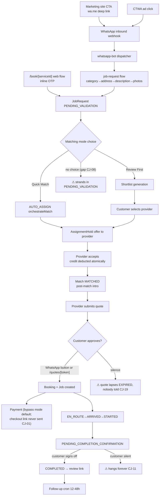
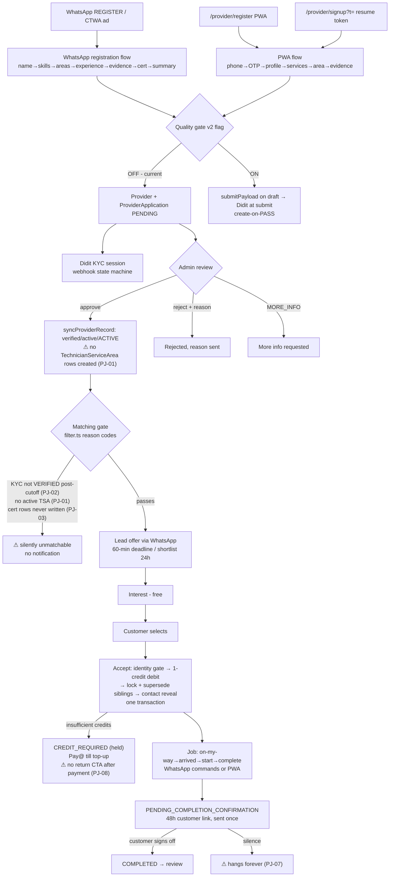
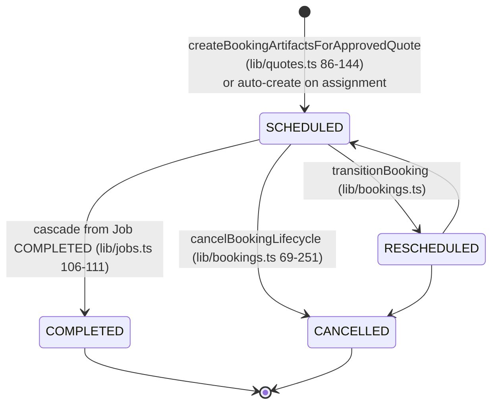
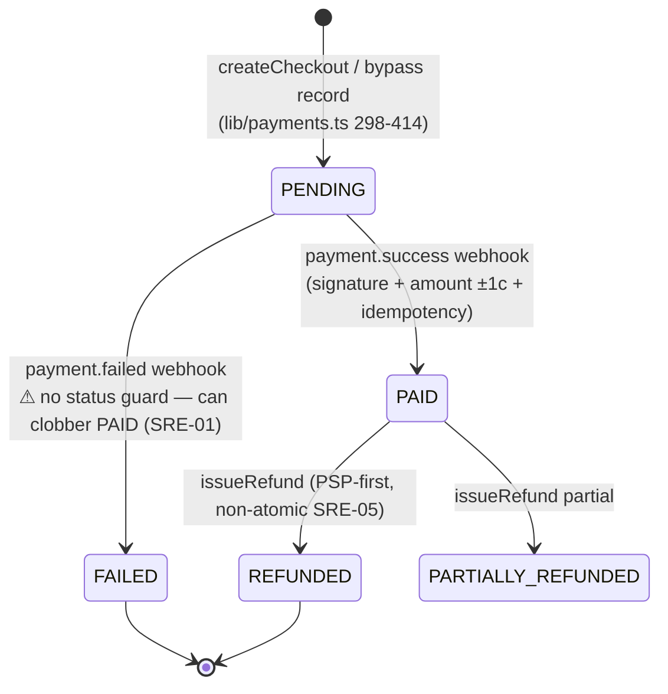
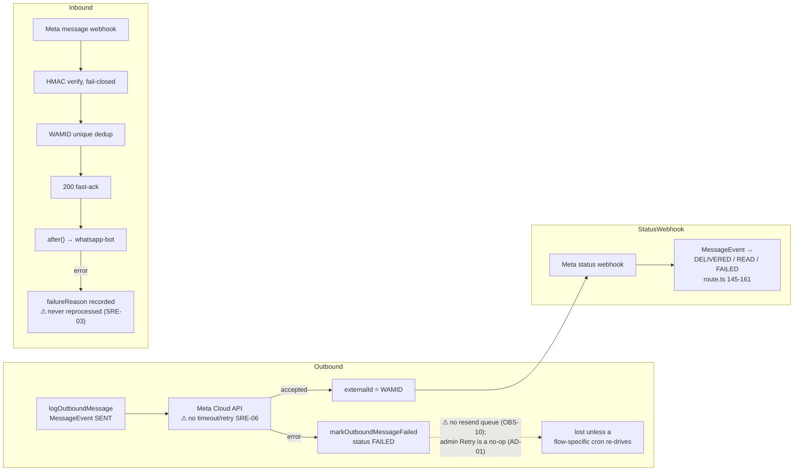
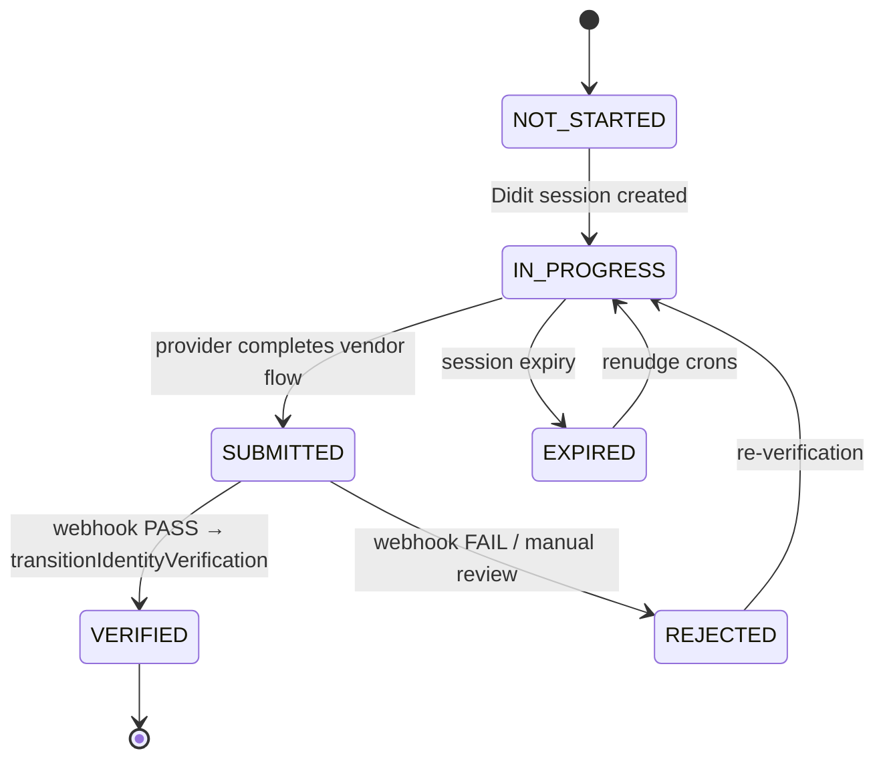

# Journey Maps — Plug A Pro Platform Audit (2026-07-06)

The journeys as **actually implemented** (code-verified), not as designed. File references point at the implementing modules.

---

## 1. Customer journey

| # | Step | Implementing files | Persistence |
|---|------|--------------------|-------------|
| 1 | Entry: marketing site — every CTA is a `wa.me/27693552447?text=…` deep link; 3 forms POST to leads API then redirect to WhatsApp | `marketing/lib/whatsapp.ts:13`, `marketing/components/marketing/Hero.tsx:54`, `marketing/app/api/leads/route.ts` | `marketing_leads`, `onboarding_intakes` |
| 2 | Entry: WhatsApp inbound — Meta webhook, signature-verified, WAMID-deduped, async via `after()` | `app/api/webhooks/whatsapp/route.ts:35-141` → `lib/whatsapp-bot.ts:682` | `InboundWhatsAppMessage`, `MessageEvent` |
| 3 | Entry: CTWA ads — `message.referral` captured; routing override provider-only, flag-gated | `lib/whatsapp-bot.ts:1230-1252`, `lib/whatsapp-referral.ts:68` | `Conversation.data.ctwaReferral` (survives session reset) |
| 4 | Entry: web booking — `/book/[serviceId]` drafts logged-out, inline OTP at submit | `app/(customer)/book/[serviceId]/page.tsx`, `components/customer/BookingFlow.tsx:631` | `JobRequest` |
| 5 | Bot dispatcher — keyword/button routing, role guards, ~40 stateless button intercepts | `lib/whatsapp-bot.ts:1015-2545` | `Conversation` (phone-keyed, 30-min TTL) |
| 6 | Request flow — category → name → structured address → description → availability → preference → photos (max 5) → summary confirm | `lib/whatsapp-flows/job-request.ts:340-1616` | `Conversation.data` per step |
| 7 | Submit — service-area re-check → waitlist or `createJobRequest` (PENDING_VALIDATION) → ticket CTA + matching-mode buttons | `lib/whatsapp-flows/job-request.ts:1618-1915`, `lib/job-requests/create-job-request.ts:534-611` | `JobRequest`, `Address`, `Attachment`, `WorkflowEvent` |
| 8 | Matching-mode choice — Quick Match (AUTO_ASSIGN) or Review First (shortlist) | `lib/whatsapp-flows/status.ts:182-217`, `lib/request-matching-mode.ts:166-389` | `JobRequest.status/assignmentMode` |
| 9 | Matching → provider accept — AssignmentHold offer → accept → Match MATCHED → post-match intro to both parties | `lib/matching/orchestrator.ts`, `lib/matching/dispatch.ts`, `lib/post-match-communications.ts:325-444` | `AssignmentHold`, `Lead`, `Match`, `DispatchDecision` |
| 10 | Quote — provider submits; customer approves via WhatsApp buttons or `/quotes/[token]` (atomic claim, expiry + phone binding) | `app/api/technician/quotes/route.ts:130-176`, `lib/quotes.ts:146-300`, `app/quotes/[token]/page.tsx` | `Quote` (approvalToken) |
| 11 | Booking — created inside quote approval; date = provider's `quote.preferredDate`; or auto-created on assignment | `lib/quotes.ts:57-144,233`, `lib/matching/service.ts:2901-2949` | `Booking`, `Job` |
| 12 | Payment — default mode `bypass` (offline); checkout/Pay@Go paths exist but the link is never sent to the customer (finding CJ-01) | `lib/payments.ts:77-79,302-414`, `app/api/webhooks/payments/route.ts` | `Payment` |
| 13 | Status updates — provider WhatsApp commands drive `transitionJob`; EN_ROUTE/ARRIVED/STARTED/COMPLETED message the customer | `lib/jobs.ts:17-244`, `lib/provider-whatsapp-job-commands.ts:423-577` | `Job`, `JobStatusEvent` |
| 14 | Completion + review — customer sign-off (`/confirm-completion/[token]` or buttons) → `/review/[token]`; follow-up cron 12–48h | `lib/completion-check.ts:49-95`, `app/review/[token]/actions.ts`, `app/api/cron/follow-up/route.ts` | `Review` |
| 15 | Post-job — rebook keywords; disputes web-only (WhatsApp support is a dead-end, finding CJ-04); reschedule/cancel flows | `lib/whatsapp-bot.ts:2992-3158`, `app/(customer)/bookings/[id]/page.tsx:230` | `Dispute`, `AuditLog` |
| 16 | Web self-service ticket — `/requests/access/[token]` (72h TTL, revocable): status, shortlist, select provider, cancel | `lib/job-request-access.ts`, `app/requests/access/[token]/page.tsx` | `JobRequest.customerAccessToken*` |

**Mid-flow resume:** conversation state persists in `Conversation` (survives silence); expired `job_request` sessions get a "Continue booking" prompt only if a category was chosen; pre-expiry warning cron covers registration only; abandoned-request nudge cron exists but is flag-gated.

---

## 2. Provider journey

*(See findings PJ-xx in the [findings register](./FINDINGS_REGISTER.md).)*

| # | Step | Implementing files | Persistence |
|---|------|--------------------|-------------|
| 1 | Entry — WhatsApp keyword/CTWA routing or web `/provider/register` (PWA), `/provider/signup?t=` (resume token) | `lib/whatsapp-flows/registration.ts`, `lib/provider-registration/pwa-flow.ts`, `app/provider/signup/page.tsx` | `ProviderApplicationDraft` |
| 2 | Registration steps — name, skills, service areas, experience, evidence photos, certification refs, ID number | `lib/whatsapp-flows/registration.ts`, `lib/provider-registration/` | draft fields + Blob uploads |
| 3 | Recovery — resume tokens (SHA-256 hashed), onboarding-recovery cron nudges stalled drafts every 20 min | `lib/provider-registration/tokens.ts`, `app/api/cron/provider-onboarding-recovery` | `ProviderResumeToken` |
| 4 | Submit — application created (quality gate v2 adds Didit-at-submit + evidence + cert, create-on-PASS; flag OFF) | `lib/provider-applications-submit.ts`, `lib/provider-onboarding/quality-gate-submission.ts` | `ProviderApplication`, `WorkflowEvent PROVIDER_APPLICATION_SUBMITTED` |
| 5 | KYC — Didit session, webhook-driven state machine, renudge crons | `lib/identity-verification/orchestrator.ts` | `ProviderIdentityVerification`, `ProviderVerificationEvent`, `Provider.kycStatus` |
| 6 | Review — admin approve (atomic claim → Supabase user → syncProviderRecord → categories) / reject with reason / MORE_INFO | `app/(admin)/admin/applications/page.tsx:293-415` | `ProviderApplication.status`, `Provider` |
| 7 | Matchability — matching gate: active + service area (jhb_west) + skills + KYC (grace flag) + cert/equipment filters | `lib/matching/filter.ts` | — |
| 8 | Lead receipt — WhatsApp offer with lead access token page; view/interest/accept | `lib/matching/dispatch.ts`, `app/leads/access/[token]/page.tsx` | `Lead`, `AssignmentHold` |
| 9 | Accept + credit — atomic accept/credit-check/deduct/lock in one transaction; insufficient credits → top-up (Pay@Go) | `lib/selected-provider-acceptance.ts:112-356`, `lib/provider-credit-application.ts` | `Lead`, `ProviderWallet`, ledger |
| 10 | Job execution — WhatsApp text commands or provider PWA; `transitionJob` state machine | `lib/provider-whatsapp-job-commands.ts:423-577`, `lib/jobs.ts` | `Job`, `JobStatusEvent` |
| 11 | Completion — provider marks done → PENDING_COMPLETION_CONFIRMATION → customer sign-off → COMPLETED | `lib/jobs.ts`, `lib/completion-check.ts` | `Job`, `Booking` |
| 12 | Earnings — provider wallet (credits), invoices; no payout rails (cash/EFT direct from customer) | `app/(provider)/`, `lib/provider-credit-*` | `ProviderWallet`, ledger |

Key provider-side gaps: approval never provisions service areas (PJ-01); post-cutoff KYC unmatchables get no nudge (PJ-02); certifications captured at signup are never promoted to matchable rows (PJ-03); PWA drafts have no recovery lane (PJ-05); earnings page reads a `ProviderPayout` table that nothing writes (PJ-09).

---

## 3. Admin journey

| Area | Route | Capability |
|---|---|---|
| Control tower | `/admin` | Hero metrics, 7 SLA queue cards, matching health (24h), previews, breach banner, stale-data banner |
| Validation | `/admin/validation` | Claim/release, mark-ready→auto-dispatch, cancel, per-request audit trail |
| Dispatch | `/admin/dispatch` | Auto-assign, rerank shortlist, force-assign with reason code, redispatch, escalate-to-supply, unified activity feed |
| Applications | `/admin/applications` | Approve (atomic, KYC pre-flight + completeness + duplicate gates), reject with required reason, MORE_INFO, per-category approval, recovery nudges |
| Verifications | `/admin/verifications` | Didit/manual KYC review, vendor config |
| Quotes/Bookings | `/admin/quotes`, `/admin/bookings` | Decline/void quotes; reschedule/cancel bookings (flag `admin.crud.bookings`) |
| Payments | `/admin/payments` | 6 payment states, reconcile-to-PAID, write-off, full/partial refund, Pay@Go refresh/cancel |
| Finance | `/admin/provider-wallets`, `/provider-credit-payments`, `/invoices`, `/vouchers`, `/lead-unlock-disputes` | Wallet/credit/invoice/voucher management |
| Messages | `/admin/messages` | Last 100 outbound events + retry (⚠ retry is a no-op — AD-01) |
| Disputes | `/admin/disputes` | Claim/resolve with resolution notes, case timeline (flag `ops.v2.cases`) |
| Audit | `/admin/audit-log` | Unified AuditLog + AdminAuditEvent viewer, filtered, paginated, ADMIN/OWNER only |
| Team | `/admin/team`, `/team/permissions` | OWNER-only invite/role/deactivate/revoke + capability matrix; last-OWNER and self-guards enforced |
| Reports | `/admin/reports`, `/funnel`, `/kyc-funnel`, `/acquisition` | KPIs; funnel behind default-OFF flag; acquisition orphaned from nav |

Mutation discipline: `crudAction()` (role floor + flag check + zod + AuditLog + AdminAuditEvent in one transaction) is adopted across ~30 action files. Known bypasses: dispatch redispatch/escalate, case-lifecycle writes, `seedDefaultVendorConfigs` (AD-05/06/07).

---

## 4. Booking lifecycle

- Enforced by `VALID_BOOKING_TRANSITIONS` + CAS + `BookingStatusEvent` — **one bypass:** `lib/payments.ts:492` writes status + event manually (ARC-05).
- Booking creation writes **no** BookingStatusEvent/WorkflowEvent (OBS-08) — the timeline starts mid-story.
- Attached Job runs its own machine: SCHEDULED→EN_ROUTE→ARRIVED→STARTED→(PAUSED/AWAITING_APPROVAL)→PENDING_COMPLETION_CONFIRMATION→COMPLETED, with CANCELLED/FAILED/CALLBACK_REQUIRED exits — fully enforced by `transitionJob` (`lib/jobs.ts:17-113`).

## 5. Payment lifecycle

- **Default collection mode is `bypass`** (`lib/payments.ts:77-79`): Payment rows record offline collection; no PSP involved.
- Checkout mode risks (currently dormant): checkout created at PSP before Payment row exists (SRE-04); booking confirmation lost if send fails post-PAID (SRE-02); checkout link generated but never delivered to the customer (CJ-01); no Peach reconciliation poll; inbound refund events ignored.
- Pay@ (wallet top-ups) is the hardened path: CAS crediting, ITN recovery cron, mismatch handling.

## 6. WhatsApp communication lifecycle

- Statuses captured: SENT → DELIVERED → READ, or FAILED (+`failureReason`, `deliveredAt`, `readAt`). QUEUED exists but only as the admin retry/broadcast no-op.
- 24h customer-service window: `hasRecentInboundWhatsappSession` gates freeform sends with template-first fallback ladders (`lib/post-match-communications.ts:290-636`). When no window and no approved template: send silently no-ops with a recorded reason (CJ-03).
- Join keys: `customerId`/`bookingId`/`providerId`/`leadId` — no `jobRequestId` (OBS-06).

## 7. KYC lifecycle (the reference implementation)

- Webhook: 3-tier HMAC signature verified **before** any persistence; redacted raw payload stored (`ProviderVerificationWebhookEvent` with idempotency key); replay-safe; deliberate 500-for-retry on completion failure (`app/api/webhooks/verification/[vendor]/route.ts:36-224`).
- Transitions enforced by a table — invalid transitions throw (`lib/identity-verification/orchestrator.ts:424-489`); every change writes `ProviderVerificationEvent` (from/to, actor, decision, reasonCode) and updates `Provider.kycStatus`; terminal statuses notify the provider.
- Observability: structured PII-safe logger with Sentry sink (`lib/identity-verification/log.ts`); `/admin/verifications` + `/admin/reports/kyc-funnel`; renudge crons.
- Enforcement points: matching gate (`lib/matching/filter.ts`, softened by the KYC grace flag), admin approval pre-flight, quality gate v2 at submit (flag OFF).

**Every other lifecycle in the platform should be brought up to this standard.**
