# Plug A Pro Customer WhatsApp and PWA Journey

**Status:** Current journey reference, source-scanned on 2026-04-30  
**Scope:** Customer/client path from WhatsApp entry through request capture, matching, provider handover, job updates, completion, and follow-up  
**Primary channel:** WhatsApp  
**Secondary channel:** Signed no-login PWA links

```mermaid
flowchart TD

%% =========================
%% 1. WhatsApp Customer Entry
%% =========================
subgraph WA["1. WhatsApp Customer Entry"]
  A1["[WhatsApp] Customer sends 'Hi' or opens Plug A Pro from WhatsApp"]
  A2["[Backend] WhatsApp webhook parses inbound message or button reply"]
  A3["[Backend] Normalize phone number and derive lookup variants"]
  A4["[Backend] Load or create conversation session"]
  A1 --> A2 --> A3 --> A4
end

%% =========================
%% 2. Identity Resolution
%% =========================
subgraph ID["2. Identity Resolution"]
  B1{"[Backend] Known phone number?"}
  B2{"[Backend] Existing customer?"}
  B3{"[Backend] Provider or provider applicant on same phone?"}
  B4["[WhatsApp] Greet existing customer by first name"]
  B5["[WhatsApp] Show customer-only menu: Request a Service, My Requests, Get Help"]
  B6["[Backend] Business rule: existing customer is not asked for first name again"]
  B7["[Backend] Business rule: existing customer does not see Find Work"]
  B8["[WhatsApp] Show discovery menu for unknown user: Request a Service or Find Work"]
  B9{"[WhatsApp] User chooses Request a Service?"}
  B10["[WhatsApp] Capture first name and customer details"]
  B11["[Backend] Create or update customer profile using normalized phone number"]
  B12["[WhatsApp] User chooses Find Work"]
  B13["[WhatsApp] Route to provider application/onboarding"]
  B14["[Backend] MVP rule: same phone number cannot be both customer and provider"]
  B15["[WhatsApp] Explain separate WhatsApp number is required or route to support"]
end

A4 --> B1
B1 -- Yes --> B2
B1 -- No --> B8
B2 -- Yes --> B4 --> B5 --> B6 --> B7
B2 -- No --> B3
B3 -- Yes --> B14 --> B15
B3 -- No --> B8
B8 --> B9
B9 -- Yes --> B10 --> B11
B9 -- No, Find Work --> B12 --> B13

%% =========================
%% 3. Customer Request Capture
%% =========================
subgraph CAP["3. Customer Request Capture"]
  C1["[WhatsApp] Customer selects Request a Service"]
  C2["[WhatsApp] Select service category from WhatsApp list"]
  C3["[WhatsApp] Select service type or category-specific option where configured"]
  C4{"[Backend] Customer already has a usable saved address?"}
  C5{"[Backend] Multiple saved addresses?"}
  C6["[WhatsApp] Confirm default saved address"]
  C7["[WhatsApp] Choose another saved address"]
  C8["[WhatsApp] Add a new address"]
  C9{"[WhatsApp] Use selected saved address?"}
  C10["[WhatsApp] Capture street address"]
  C11["[WhatsApp] Select province from controlled list"]
  C12["[WhatsApp] Select city from controlled list"]
  C13{"[Backend] City is in active service area?"}
  C14["[WhatsApp] Select area or region from controlled list"]
  C15["[WhatsApp] Select suburb from controlled list"]
  C16["[Backend] Resolve structured address and postal code"]
  C17["[WhatsApp] Confirm full structured address"]
  C18{"[WhatsApp] Address correct?"}
  C19["[Admin/System] Add customer to service-area waitlist"]
  C20["[WhatsApp] Tell customer area is not live yet and WhatsApp will be used for follow-up"]
  C21["[WhatsApp] Capture issue description or scope note"]
  C22["[WhatsApp] Capture preferred availability"]
  C23["[Backend] Store draft request details in conversation data"]
end

B7 --> C1
B11 --> C1
C1 --> C2 --> C3 --> C4
C4 -- Yes --> C5
C5 -- Yes --> C7 --> C9
C5 -- No --> C6 --> C9
C9 -- Yes --> C21
C9 -- No, add new --> C8
C4 -- No --> C8
C8 --> C10 --> C11 --> C12 --> C13
C13 -- No --> C19 --> C20
C13 -- Yes --> C14 --> C15 --> C16 --> C17 --> C18
C18 -- No --> C10
C18 -- Yes --> C21 --> C22 --> C23

%% =========================
%% 4. Photo Upload Handling
%% =========================
subgraph PH["4. Photo Upload Handling"]
  D1["[WhatsApp] Ask customer whether to add photos"]
  D2{"[WhatsApp] Photos uploaded?"}
  D3["[WhatsApp] Customer skips photos"]
  D4["[WhatsApp] Customer sends one or more image messages"]
  D5{"[Backend] Multi-photo batch window active?"}
  D6["[Backend] Debounce and process WhatsApp batch together"]
  D7{"[Backend] Duplicate media id?"}
  D8["[Backend] Ignore duplicate media id"]
  D9{"[Backend] More than 5 photos total?"}
  D10["[Backend] Store first 5 valid image photos"]
  D11["[WhatsApp] Tell customer maximum of 5 photos is accepted"]
  D12["[Backend] Reject non-image documents for this step"]
  D13["[Backend] Upload photos to storage as customer_photo attachments"]
  D14["[Backend] Keep attachments on draft until request exists"]
  D15["[WhatsApp] Send one progress/confirmation message after batch processing"]
  D16["[Backend] Rule: attached customer photos become visible to provider after lead unlock"]
end

C23 --> D1 --> D2
D2 -- No --> D3 --> D16
D2 -- Yes --> D4 --> D5
D5 -- Yes --> D6 --> D7
D5 -- No --> D7
D7 -- Yes --> D8 --> D15
D7 -- No --> D9
D9 -- Yes --> D10 --> D11 --> D15
D9 -- No --> D13 --> D14 --> D15
D4 --> D12
D15 --> D16

%% =========================
%% 5. Request Submission
%% =========================
subgraph SUB["5. Request Submission"]
  E1["[WhatsApp] Show request summary: service, address, availability, photos"]
  E2{"[WhatsApp] Submit request?"}
  E3["[WhatsApp] Cancel or restart request capture"]
  E4["[Backend] Deduplicate against active open or matching request"]
  E5{"[Backend] Active duplicate request found?"}
  E6["[WhatsApp] Tell customer active request already exists"]
  E7["[Backend] Create service request atomically"]
  E8["[Backend] Upsert customer, create address, create JobRequest, open dispatch case"]
  E9["[Backend] Backfill uploaded photo attachments onto JobRequest"]
  E10["[Backend] Generate signed customer ticket token and URL"]
  E11["[WhatsApp] Send submitted confirmation, reference number, and View Ticket CTA"]
  E12["[PWA Signed Link] Customer views ticket without login"]
  E13["[Backend] Rule: signed ticket link is scoped to one request and does not require login"]
end

D16 --> E1 --> E2
E2 -- No --> E3 --> C1
E2 -- Yes --> E4 --> E5
E5 -- Yes --> E6
E5 -- No --> E7 --> E8 --> E9 --> E10 --> E11 --> E12 --> E13

%% =========================
%% 6. Matching & Provider Acceptance
%% =========================
subgraph MAT["6. Matching & Provider Acceptance"]
  F1["[Backend] Start matching after request creation"]
  F2["[Backend] Filter providers by active status, KYC/verification, service, area, availability, schedule, capacity, skills, certifications, equipment, and trust rules"]
  F3{"[Backend] Eligible provider matched?"}
  F4["[Admin/System] No immediate match: retry by cron, redispatch, widen search, or escalate to supply"]
  F5["[WhatsApp] Optional customer update: request received and still matching"]
  F6["[Backend] Create lead and assignment hold for next eligible provider"]
  F7["[WhatsApp] Send provider lead offer with signed PWA job link"]
  F8["[Provider Action] Provider opens lead preview or taps accept"]
  F9{"[Provider Action] Provider unlocks/accepts lead?"}
  F10["[PWA Signed Link] Provider can unlock lead for 1 Plug A Pro credit"]
  F11{"[Backend] Provider has 1 credit and is approved/active?"}
  F12["[Backend] Debit 1 credit through wallet ledger and create LeadUnlock"]
  F13["[Backend] Accept lead, create Match, mark JobRequest MATCHED, release other holds"]
  F14["[Backend] Reveal customer contact, full address, and customer photos to accepted provider"]
  F15["[Backend] Rule: customer is only told after provider acceptance succeeds"]
  F16["[Backend] Unlock or acceptance failed: insufficient credits, inactive provider, expired offer, taken offer, or concurrency"]
  F17["[Backend] Do not notify customer about failed provider attempt"]
  F18["[Admin/System] Try next eligible provider, retry later, or route to fallback"]
end

E13 --> F1 --> F2 --> F3
F3 -- No --> F4 --> F5 --> F1
F3 -- Yes --> F6 --> F7 --> F8 --> F9
F9 -- Preview only --> F10 --> F11
F9 -- Accept from WhatsApp/PWA --> F11
F11 -- Yes --> F12 --> F13 --> F14 --> F15
F11 -- No --> F16 --> F17 --> F18 --> F3

%% =========================
%% 7. Customer Handover
%% =========================
subgraph HAN["7. Customer Handover"]
  G1["[Backend] Create signed customer provider-handover token"]
  G2["[WhatsApp] Send named provider acceptance notification"]
  G3["[WhatsApp] Share provider name and contact number"]
  G4["[WhatsApp] Send View Provider CTA"]
  G5["[PWA Signed Link] Customer views provider handover page without login"]
  G6["[Backend] Handover page validates accepted lead, matched provider, active request, and token"]
  G7{"[Backend] Customer notified?"}
  G8["[Admin/System] If notification delivery fails, support can resend from request context"]
end

F15 --> G1 --> G2 --> G3 --> G4 --> G5 --> G6 --> G7
G7 -- No --> G8

%% =========================
%% 8. Job Progress Updates
%% =========================
subgraph JOB["8. Job Progress Updates"]
  H1["[Provider Action] Provider confirms planned arrival time from signed job link"]
  H2["[Backend] Validate arrival against customer availability"]
  H3{"[Backend] Arrival time valid?"}
  H4["[WhatsApp] Customer receives planned arrival update"]
  H5["[Provider Action] Provider marks customer contacted"]
  H6["[Provider Action] Provider marks on the way"]
  H7["[WhatsApp] Customer receives on-the-way update"]
  H8["[Provider Action] Provider marks arrived"]
  H9["[WhatsApp] Customer receives arrived update"]
  H10["[Provider Action] Provider starts job"]
  H11["[WhatsApp] Customer receives job-started update where enabled"]
  H12["[Admin/System] Fallback: delayed provider, invalid arrival, unreachable party, customer issue, reassignment, or support case"]
  H13["[WhatsApp] Customer receives support, delay, or reassignment update if needed"]
end

G7 -- Yes --> H1
H1 --> H2 --> H3
H3 -- Yes --> H4 --> H5 --> H6 --> H7 --> H8 --> H9 --> H10 --> H11
H3 -- No --> H12 --> H13
H4 --> H12
H7 --> H12
H9 --> H12

%% =========================
%% 9. Completion & Follow-Up
%% =========================
subgraph DONE["9. Completion & Follow-Up"]
  I1["[Provider Action] Provider marks job ready for completion or completed"]
  I2["[Backend] Update job status and immutable status/audit history"]
  I3["[WhatsApp] Customer receives completion or sign-off request"]
  I4["[PWA Signed Link] Customer can confirm completion without login where token flow is used"]
  I5{"[WhatsApp/PWA] Customer reports issue?"}
  I6["[Admin/System] Support follow-up, field exception, dispute, or reassignment handling"]
  I7["[WhatsApp] Customer receives follow-up outcome"]
  I8["[Backend] Booking moves to completed after valid completion path"]
  I9["[WhatsApp] Ask for rating, feedback, or review"]
  I10["[Backend] Invoice/payment placeholder: online collection and invoice flow may be deferred or category-dependent"]
  I11["[WhatsApp] Send invoice, receipt, payment link, or manual follow-up when implemented"]
  I12["[PWA Signed Link] Customer can revisit ticket, provider handover, photos, quotes, and job history without login"]
end

H11 --> I1 --> I2 --> I3 --> I4 --> I5
I5 -- Yes --> I6 --> I7 --> I12
I5 -- No --> I8 --> I9 --> I10 --> I11 --> I12
```

## Key Flow Stages

The customer journey is WhatsApp-first. The backend normalizes the inbound phone number, resolves whether the sender is a customer, provider, provider applicant, or unknown user, and then routes the sender into the correct role-aware menu.

Existing customers are greeted by name and only receive customer options. They can request a service, view requests, or get help, but they do not see Find Work and they are not asked for first name again. Unknown users can choose Request a Service or Find Work. Provider or provider-applicant phone conflicts are blocked for MVP because one phone number cannot act as both customer and provider.

Request capture happens in WhatsApp. The current implementation uses controlled lists for province, city, area/region, and suburb, supports saved address confirmation and new structured address capture, collects preferred availability, supports optional image-only customer photos, and caps customer photos at 5. Multi-photo WhatsApp batches are debounced so the customer receives one confirmation after batch handling instead of one confirmation per image.

After submission, the backend creates the customer, address, and JobRequest atomically, backfills uploaded customer photos to the request, opens a dispatch case, starts matching, and generates a signed ticket URL. The customer can view the ticket in the PWA without logging in.

Provider matching is sequential and controlled by eligibility rules. A provider must be active and approved, and accepting/unlocking a lead costs 1 Plug A Pro credit through the provider wallet ledger. Customer contact details, full address, and uploaded photos are released only after successful provider acceptance. Failed unlock or acceptance attempts do not notify the customer.

Once acceptance succeeds, the customer receives the named provider notification, provider phone number, and a signed no-login provider handover link. Provider-triggered arrival and job progress actions drive WhatsApp updates to the customer. Completion flows lead into customer sign-off, support escalation, rating, and invoice/payment follow-up.

## Source Scan Basis

This diagram was generated after scanning the current source paths for the journey, including:

- `field-service/lib/whatsapp-bot.ts`
- `field-service/lib/whatsapp-identity.ts`
- `field-service/lib/whatsapp-flows/job-request.ts`
- `field-service/lib/job-requests/create-job-request.ts`
- `field-service/lib/job-request-access.ts`
- `field-service/lib/customer-provider-handover-access.ts`
- `field-service/lib/matching-engine.ts`
- `field-service/lib/matching/service.ts`
- `field-service/lib/post-match-communications.ts`
- `field-service/lib/lead-unlocks.ts`
- `field-service/lib/provider-lead-access.ts`
- `field-service/lib/accepted-job-actions.ts`
- `field-service/lib/jobs.ts`
- related WhatsApp, matching, photo-batching, signed-link, wallet, and handover tests under `field-service/__tests__/`

## Assumptions and Placeholders

- The diagram includes issue description/scope capture as an expected product stage. The scanned WhatsApp flow currently stores preferred availability in the request description and does not appear to have a separate free-text issue-description step in the active WhatsApp path.
- Invoice, receipt, customer payment collection, and payment follow-up are shown as placeholders because the source and docs indicate payment policy is still category-dependent or deferred in parts of the MVP.
- Admin/system fallback covers retry matching, redispatch, escalation to supply, support, field exceptions, and disputes. The exact operator UI path may vary by current admin capability.
- Signed PWA links are scoped, tokenized, and no-login by design, but expiry and revocation rules still apply.
