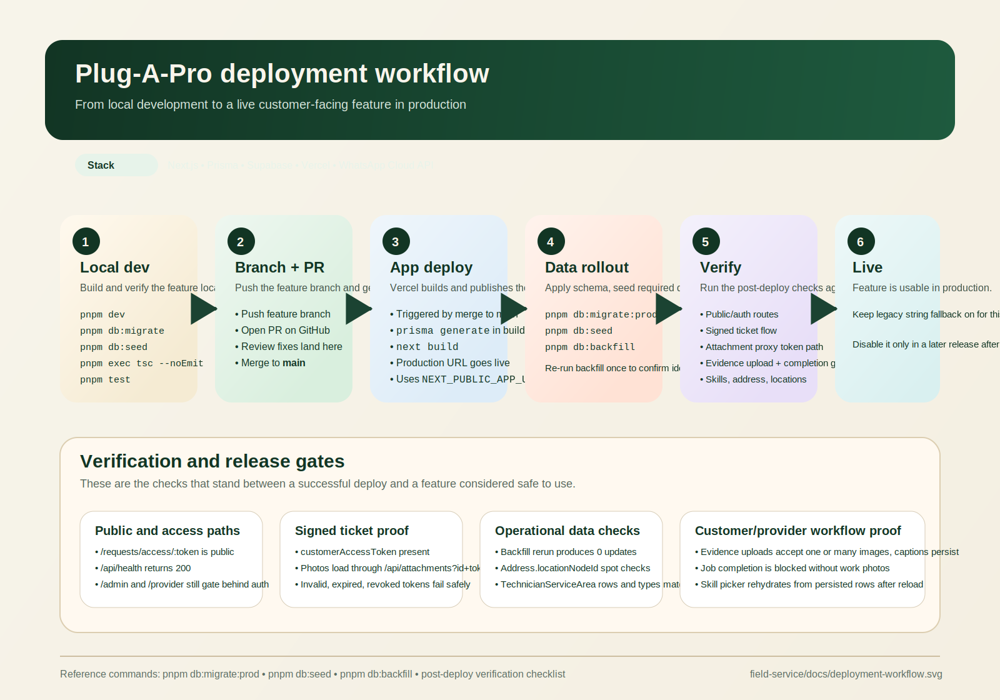

# Deployment Framework

This framework standardizes how Plug A Pro features move from merged code to a verified production release.

It combines:

- the visual workflow: [deployment-workflow.svg](./deployment-workflow.svg)
- the operational verification checklist: [post-deploy-verification.md](./post-deploy-verification.md)
- a release gate template generated per deployment via `pnpm release:gates`

## Workflow View



## Release Standard

Every production release must have:

1. a release-specific deployment gate file under `docs/releases/`
2. OpenBrain kickoff, gate, and close-out logs
3. explicit pass/block decisions at each gate
4. links to evidence, not memory-only summaries

## Gate Model

Use these gate statuses consistently:

- `PASS` — verified with direct evidence
- `BLOCKED` — cannot proceed safely
- `DEFERRED` — intentionally postponed, with explicit risk accepted
- `FAIL` — tested and failed
- `NOT_RUN` — not executed yet

## Required Gates

### Gate 0 — Change Readiness

Purpose:
- confirm the release scope
- confirm PRs are merged or explicitly identified
- confirm tests and typecheck are green before deploy

Minimum evidence:
- PR number(s)
- branch/commit reference
- latest `pnpm exec tsc --noEmit`
- latest `pnpm test`

### Gate 1 — Schema and Migration Readiness

Purpose:
- confirm production schema changes are identified and safe to apply

Minimum evidence:
- migration names
- rollback notes
- any one-off scripts required after deploy

### Gate 2 — Production Deploy Readiness

Purpose:
- confirm environment and platform assumptions before running the release

Minimum evidence:
- `NEXT_PUBLIC_APP_URL`
- Vercel target environment
- required secrets present
- webhook/public callback constraints noted

### Gate 3 — Data Rollout Readiness

Purpose:
- confirm seed and backfill responsibilities after code is live

Minimum evidence:
- `pnpm db:migrate:prod`
- `pnpm db:seed`
- `pnpm db:backfill`
- idempotency expectations for reruns

### Gate 4 — Public/Auth Access Validation

Purpose:
- prove route protection and public signed access behave correctly after deploy

Minimum evidence:
- protected route redirects
- signed/public routes render correctly
- monitoring/health endpoints behave as expected

### Gate 5 — Feature Smoke Validation

Purpose:
- verify the release’s user-facing behaviors on production

Minimum evidence:
- direct runtime checks
- network/API proof where relevant
- failure-path verification for tokenized or privileged flows

### Gate 6 — Backfill and Operational Risk Review

Purpose:
- confirm unresolved counts, partial failures, and deferred switches are acceptable

Minimum evidence:
- unresolved counts
- follow-up deploy decisions
- explicit go/no-go on any feature flag or fallback switch

### Gate 7 — Release Close-Out

Purpose:
- record the final decision and handoff state

Minimum evidence:
- deploy result
- issues found
- deferred risks
- links to follow-up PRs/tasks if any

## OpenBrain Logging Standard

Every release should log at minimum:

1. kickoff
2. gate decision update
3. close-out

Use project:

```bash
--project "Plug A Pro"
```

Use tags shaped like:

```text
domain:engineering,deployment,release,production
```

Recommended titles:

- `release kickoff — <release-name> (<date>)`
- `release gate update — <release-name> gate <n> (<date>)`
- `release close-out — <release-name> (<date>)`

## OpenBrain CLI Pattern

If the local OpenBrain CLI is available at `/Users/shimane/Library/CloudStorage/Dropbox/KgolaEntle Holdings/Solutions/Projects/MobileApps/OpenBrain/backend`:

```bash
cd /Users/shimane/Library/CloudStorage/Dropbox/KgolaEntle Holdings/Solutions/Projects/MobileApps/OpenBrain/backend
pnpm brain -- knowledge add \
  --project "Plug A Pro" \
  --domain "engineering" \
  --title "release kickoff — <release-name> (<date>)" \
  --tags "deployment,release,production" \
  --content "Kickoff for <release-name>. Scope: <scope>. PRs: <prs>. Planned gates: 0-7."
```

## Standard Repo Commands

Local validation:

```bash
pnpm exec tsc --noEmit
pnpm test
```

Production rollout:

```bash
pnpm db:migrate:prod
pnpm db:seed
pnpm db:backfill
```

Release gate scaffold:

```bash
pnpm release:gates -- --release "<release-name>" --pr "<org/repo#123>" --branch "main"
```

## Release Artifacts

The generated gate file should live in:

```text
docs/releases/YYYY-MM-DD-<release-slug>-deployment-gates.md
```

That file becomes the canonical release handoff and evidence log for the deployment.
